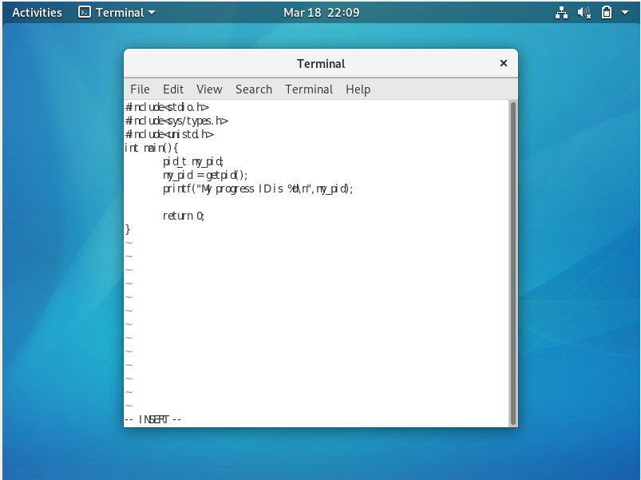
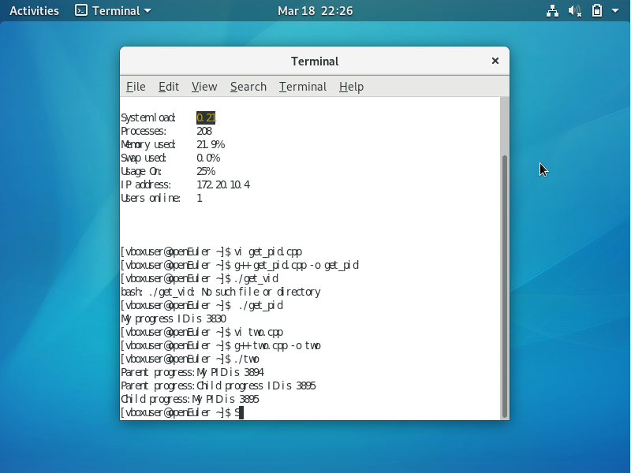
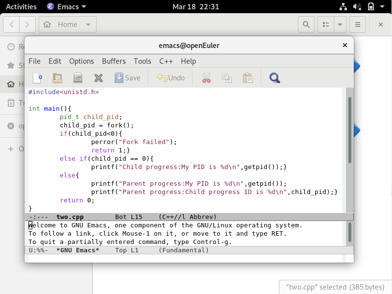
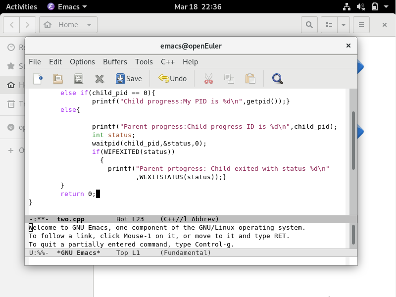
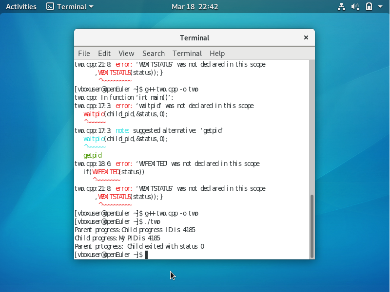
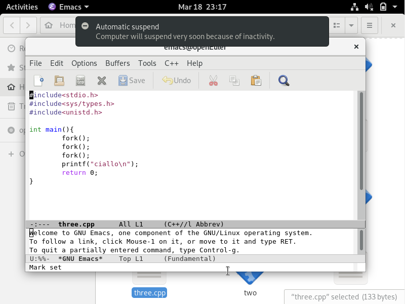
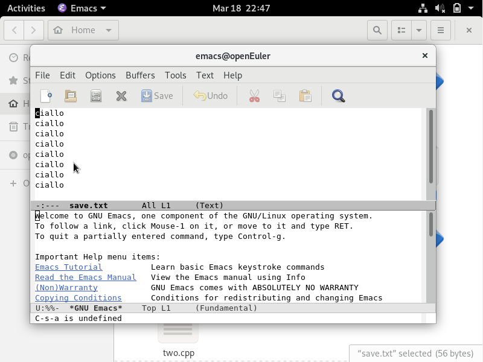
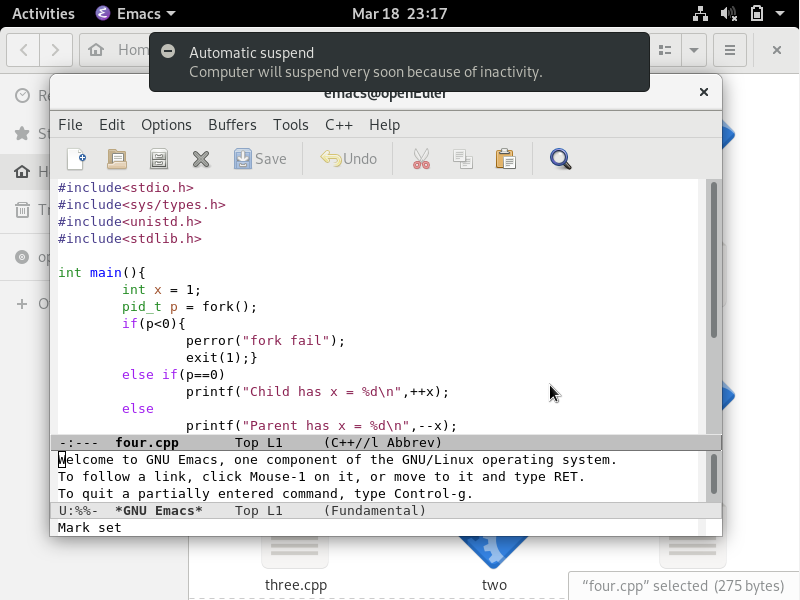
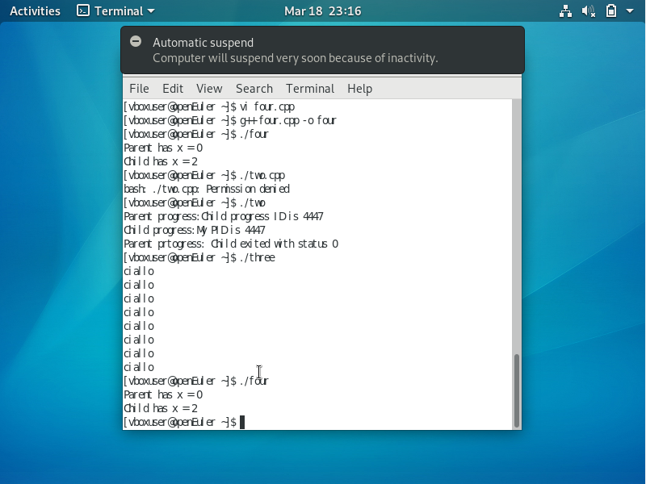

# Linux环境下C程序编译

## 创建cpp程序并运行的的方法

1.打开虚拟机命令行
2.创建cpp文件： vi name.cpp
3.输入代码
4.保存并退出：按ESC 输入：w 再输入：wq
5.编译代码：g++ name.cpp -o name
6.运行程序：./name.cpp

## 获取进程的PID

代码：
运行结果:

## 获进程创建与父子进程关系实验

代码：
运行结果:
Parent process: My PID is 70845
Parent process: Child process ID is 70846
Child process:My PID is 70846

## 父进程等待子进程退出测试

增加代码：
运行结果:
父进程在调用 waitpid() 后进入等待状态，直至子进程退出后才继续执行后续代码。
子进程正常退出（退出状态为 0），并且父进程通过 WIFEXITED 与 WEXITSTATUS 检查子进程的退出状态

## 多次 fork() 进程创建实验

代码：
创建一个用来保存结果的文件save.txt

touch save.txt
编译代码并将运行的结果导入到save.txt

g++ san.cpp -o san
./san > save.txt

运行结果:
这表明：每次调用 fork() 后，当前进程都会复制出一个新的进程。

首次 fork() 后：2 个进程
再次 fork() 后：每个进程又复制出一个子进程，总数达到 4 个
第三次 fork() 后：总数达到 (2^3 = 8) 个进程
因此，程序共输出 8 次 ciallo，验证了进程复制的倍增效果。

## 进程独立性实验

代码：
运行结果:
结果表明，父子进程在 fork() 调用后拥有各自独立的内存空间。

父进程对变量 x 执行自减操作，输出结果为0；
子进程对变量 x 执行自增操作，输出结果为 2。
这验证了进程间变量互不干扰的特性。