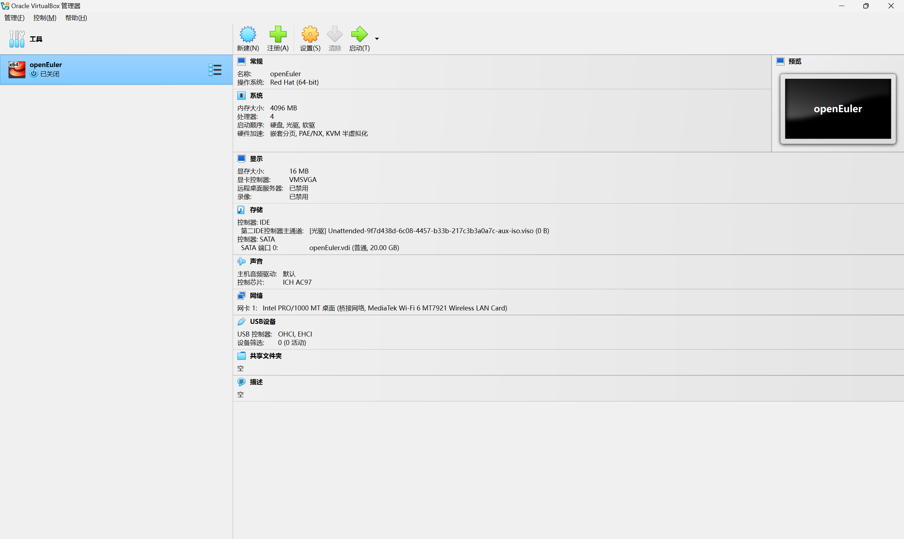
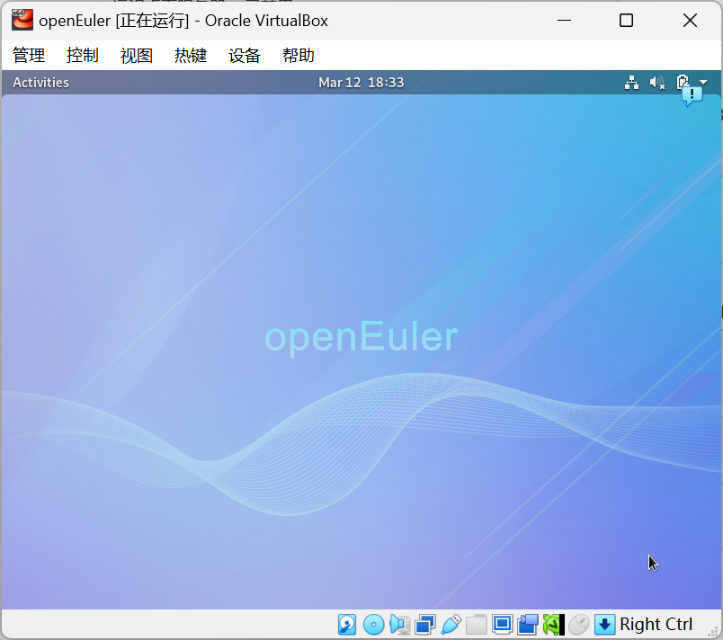

# openEuler 操作系统安装报告

## 一、安装环境
1.宿主机操作系统：Windows 11
2.虚拟化软件：VirtualBox 7.1.6
3.openEuler 镜像版本：openEuler 20.03 LTS 

## 二、安装步骤

### （一）下载 openEuler 镜像
1. 访问 openEuler 官方网站（[https://openeuler.org/](https://openeuler.org/)）。
2. 在下载页面找到对应版本的 ISO 镜像文件，点击下载。

### （二）创建虚拟机
1.打开 VirtualBox 软件。
2.点击“新建”按钮，创建新的虚拟机。
3.虚拟机名称：输入“openEuler”或其他自定义名称。
4.在ISO Image中选择刚才下载的镜像。
5.类型：选择“Linux”。
6.内存大小：分配4096内存，4CPU
7.虚拟硬盘：选择“创建虚拟硬盘”，设置为 20 GB 。
8.联网：在设置中找到网络，选择桥接网卡。

### （三）安装操作系统
1. 启动虚拟机，并以root登录
2. 配置清华源：输入sudo vi /etc/yum.repos.d/openEuler_x86_64.repo,点击i开始编辑
   [osrepo]
   name=osrepo
   baseurl=https://mirrors.tuna.tsinghua.edu.cn/openeuler/openEuler-20.03-LTS/OS/x86_64/
   enabled=1
   gpgcheck=1
   gpgkey=https://mirrors.tuna.tsinghua.edu.cn/openeuler/openEuler-20.03-LTS/OS/x86_64/RPM-GPG-KEY-openEuler
   填写完点击esc键，输入：wq！强制保存。
3. 安装GNOME桌面：依次输入以下指令，安装gnome及相关组件和terminal:
   dnf install gnome-shell gdm gnome-session
   dnf install gnome-terminal
4. 设置开机自启动：输入以下指令：
                  systemctl enable gdm.service
                  systemctl set-default graphical.target
                  依次输入以下指令，补全丢上文件：
                  cd /tmp
                  wget https://gitee.com/name1e5s/xsession/raw/master/Xsession
                  mv Xsession /etc/gdm/
                  chmod 0777 /etc/gdm/Xsession
5. 重启虚拟机重新登陆。