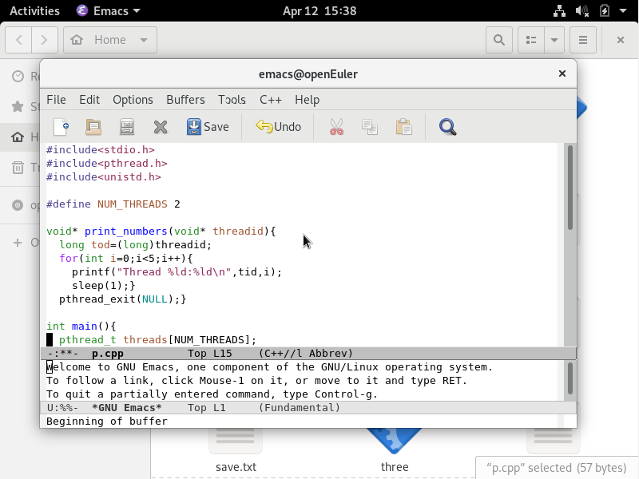
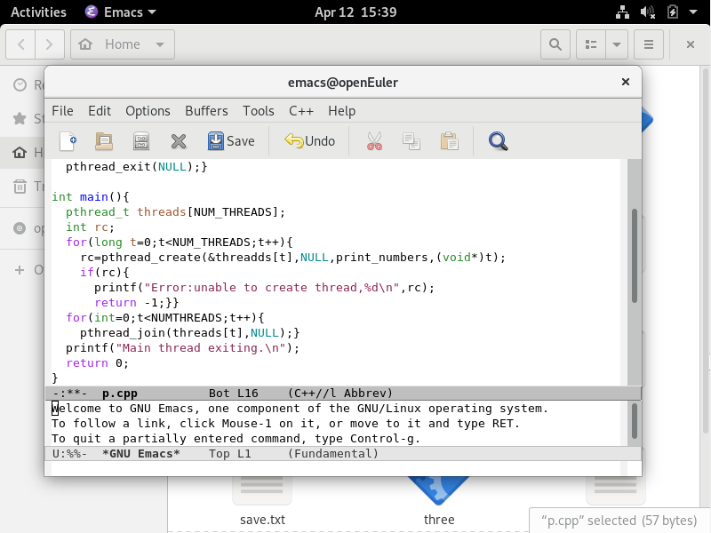
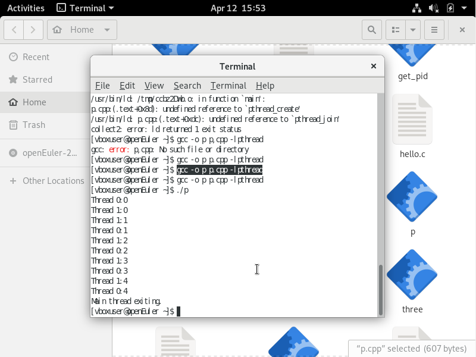
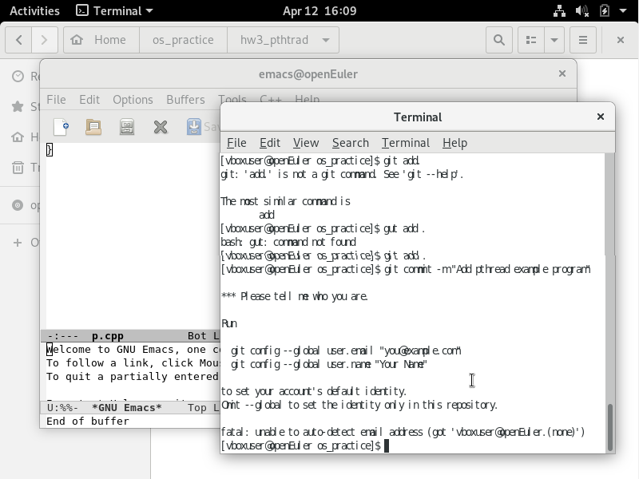
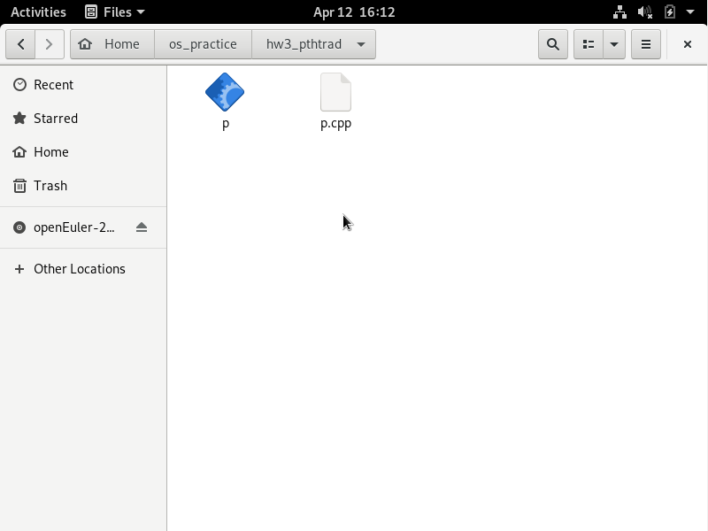
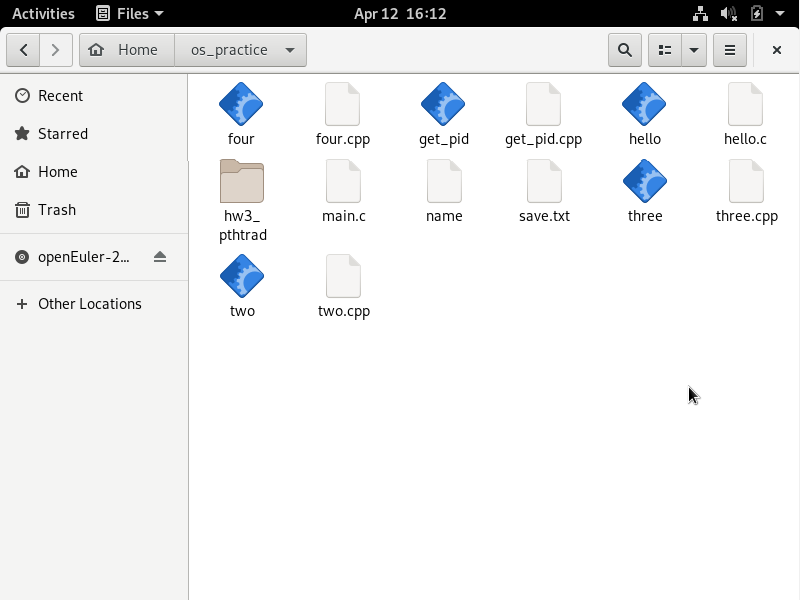

# 多线程编程实践报告  

## 一、实验目的  
学习使用 pthread 库进行多线程编程
熟悉 Git 工具的使用  

## 二、实验环境  
- 操作系统：Linux  
- 编程语言：C++  

## 三、实验内容
### 1.使用 pthread 库编写多线程程序

### 2.编译和运行程序
使用以下命令编译和运行上述程序：
gcc -o p p.cpp -lpthread  
./p 

运行结果：

### 3.使用 Git 管理项目
创建项目目录并进入：
mkdir os_practice  
cd os_practice  
初始化 Git 仓库：git init
创建子目录并添加代码：
mkdir hw3_pthread  
cp path_to_your_code/p.cpp hw3_pthread/ 
添加所有文件并提交：
git add .  
git commit -m "Add pthread example program"  

