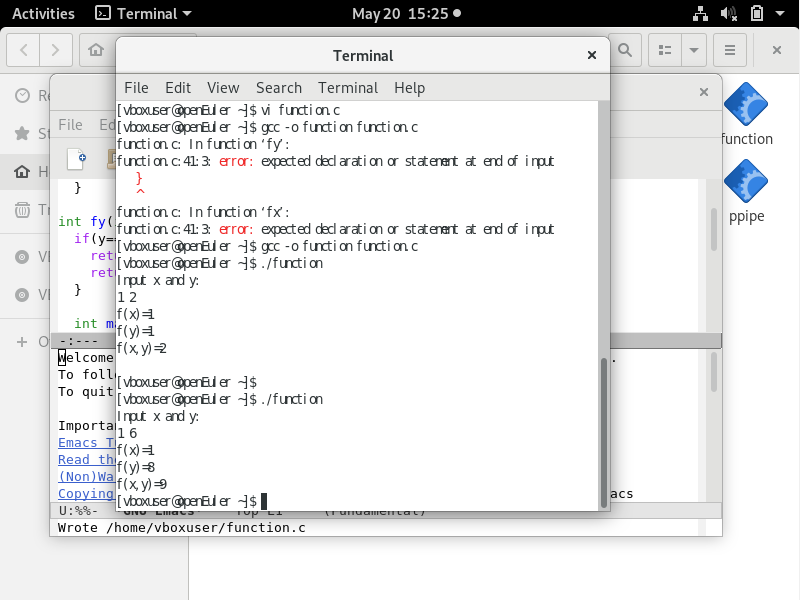
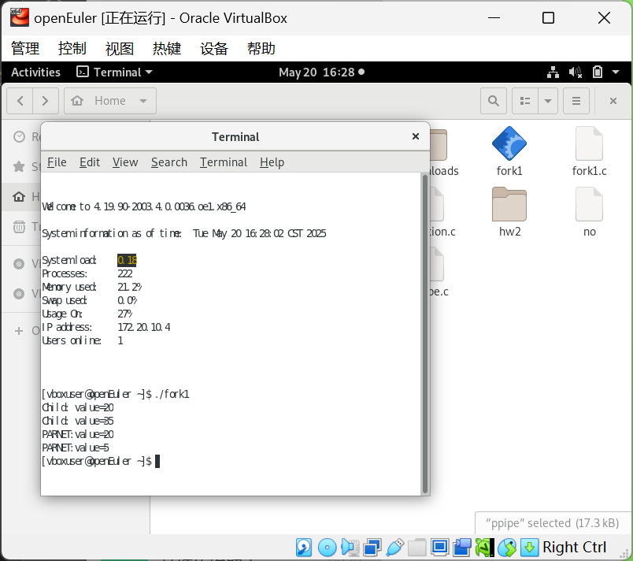
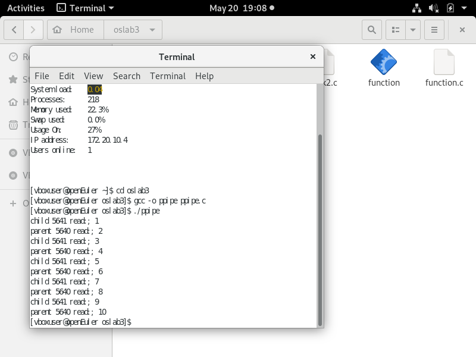

# oslab 03

软件2035 刘慈 20232241138

## 二元函数f(x,y)=f(x)+f(y)

### 代码实现

```c
#include <stdio.h>
#include <stdlib.h>
#include <sys/types.h>
#include <unistd.h>

int fx(int x) {
    if (x == 1)
        return 1;
    return x * fx(x - 1);
}

int fy(int y) {
    if (y == 1 || y == 2)
        return 1;
    return fy(y - 1) + fy(y - 2);
}

int main() {
    pid_t pid_fx, pid_fy;
    int x, y;
    printf("Input x and y:\n");
    scanf("%d %d", &x, &y);

    // 创建第一个子进程计算 f(x)
    pid_fx = fork();
    if (pid_fx == 0) {
        printf("f(x) = %d\n", fx(x));
        exit(0);
    }

    // 创建第二个子进程计算 f(y)
    pid_fy = fork();
    if (pid_fy == 0) {
        printf("f(y) = %d\n", fy(y));
        exit(0);
    }

    wait(NULL);
    wait(NULL);

    printf("f(x, y) = %d\n", fx(x) + fy(y));

    return 0;
}
```

### 运行结果



## 详解`fock1.c`

### 输入代码并观察结果

```c
#include <stdio.h>
#include <sys/types.h>
#include <unistd.h>
#include <stdlib.h>
#include <wait.h>

int value = 5;  // where?

// 定义全局变量，被后续创建的两个进程共享

int main() {
    int i;  // where?
    // 定义局部变量
    pid_t pid;
    for (i = 0; i < 2; i++) {  // How many new processes and printfs£¿
        pid = fork();
        if (pid == 0) {
            value += 15;
            printf("Child: value = %d\n", value);
        } else if (pid > 0) {
            wait(NULL);  // 使父进程等待子进程结束
            printf("PARNET: value = %d\n", value);
            exit(0);  // Notice£ºWhat will happen with or without this line?
            //   使父进程正常退出返回0，没有的话父进程会继续执行
        }
    }
}

```

### 运行结果



### 代码分析与解答

#### 1. `value` 的位置问题

```c
int value = 5;  // where?
```

- `value` 是一个全局变量，它存储在进程的全局数据段中。
- 全局变量在整个程序的生命周期内都有效，并且所有函数都可以访问它。

#### 2. `i` 的位置问题

```c
int i;  // where?
```

- `i` 是一个局部变量，存储在 `main` 函数的栈空间中。
- 局部变量只在定义它的函数内有效，函数结束后，变量的存储空间会被回收。

#### 3. `for` 循环中的进程创建和输出

```c
for (i = 0; i < 2; i++) {  // How many new processes and printfs?
    pid = fork();
    if (pid == 0) {
        value += 15;
        printf("Child: value = %d\n", value);
    } else if (pid > 0) {
        wait(NULL);  // 使父进程等待子进程结束
        printf("PARENT: value = %d\n", value);
        exit(0);  // Notice: What will happen with or without this line?
    }
}
```

### 进程和输出分析

#### (1) 多少个新进程和多少个 `printf` 调用

- 每次调用 `fork()` 会创建一个子进程，因此在 `for` 循环中会创建两个子进程。
- 每个子进程都会执行 `printf("Child: value = %d\n", value);`，因此会有两次子进程的 `printf`。
- 父进程会在每次调用 `fork()` 后进入 `else if` 分支，执行 `printf("PARENT: value = %d\n", value);`。由于循环执行两次，因此父进程也会执行两次 `printf`。

因此，总共有：

- **4 次 `printf` 调用**（2 次在子进程中，2 次在父进程中）。

#### (2) `exit(0)` 的影响

```c
exit(0);  // Notice: What will happen with or without this line?
```

- `exit(0)` 是一个系统调用，用于结束当前进程的执行，并返回退出状态码 0。
- 如果 **有 `exit(0)`**：
  - 父进程在每次调用 `fork()` 并等待子进程结束后，会立即退出。
  - 由于父进程退出，`for` 循环会提前结束，不会继续迭代。
- 如果 **没有 `exit(0)`**：
  - 父进程会继续执行 `for` 循环的下一次迭代。
  - 这会导致父进程在第一次迭代后，再次进入第二次迭代。
  - 在第二次迭代中，父进程会再次调用 `fork()` 创建一个子进程，导致更多的子进程和更多的 `printf` 调用。

### 程序的输出结果

#### 假设代码中有 `exit(0)`

在每次 `fork()` 调用后，父进程退出，`for` 循环只会执行一次。

### 关键总结

- `value` 是全局变量，存储在全局数据段；`i` 是局部变量，存储在栈空间。
- 每次调用 `fork()` 创建一个子进程，导致更多的 `printf` 调用。
- `exit(0)` 用于结束父进程的执行，防止它进入下一次循环迭代。
- 有 `exit(0)` 时输出 2 次，无 `exit(0)` 时输出更多次，具体取决于进程数量和 `value` 的修改情况。

## 管道

### 独立实验

```c
#include <stdio.h>
#include <stdlib.h>
#include <unistd.h>
int main(int argc, char* argv[]) {
    int pid;
    int pipe1[2];
    int pipe2[2];
    int x;
    if (pipe(pipe1) < 0) {
        perror("failed to create pipe1");
        exit(EXIT_FAILURE);
    }
    if (pipe(pipe2) < 0) {
        perror("failed to create pipe2");
        exit(EXIT_FAILURE);
    }
    pid = fork();
    if (pid < 0) {
        perror("failed to create new process");
        exit(EXIT_FAILURE);
    } else if (pid == 0) {
        // ⼦进程=>⽗进程：⼦进程通过pipe2[1]进⾏写
        // ⼦进程<=⽗进程：⼦进程通过pipe1[0]读
        // 因此，在⼦进程中将pipe1[1]和pipe2[0]关闭
        close(pipe1[1]);  // 关闭1的写
        close(pipe2[0]);  // 关闭2的读
        do {
            read(pipe1[0], &x, sizeof(int));
            printf("child %d read: %d\n", getpid(), x++);
            write(pipe2[1], &x, sizeof(int));
        } while (x <= 9);
        close(pipe1[0]);
        close(pipe2[1]);
    } else {
        // ⽗进程<=⼦进程:⽗进程从pipe2[0]读取⼦进程传过来的数
        // ⽗进程=>⼦进程:⽗进程将更新的值通过pipe1[1]写入，传给⼦进程
        // 因此，⽗进程会先关闭pipe1[0]和pipe2[1]端⼝
        close(pipe1[0]);
        close(pipe2[1]);
        x = 1;
        do {
            write(pipe1[1], &x, sizeof(int));
            read(pipe2[0], &x, sizeof(int));
            printf("parent %d read: %d\n", getpid(), x++);
        } while (x <= 9);
        close(pipe1[1]);
        close(pipe2[0]);
    }
    return EXIT_SUCCESS;
}
```

### 运行结果

使用make命令，编译成功后执行ppipe.c



### 代码执行流程解释

#### 1. **管道创建与初始化**

- 创建了两个管道 `pipe1` 和 `pipe2`，每个管道有两个文件描述符：
  - `pipe1[0]`：用于从 `pipe1` 读取数据。
  - `pipe1[1]`：用于向 `pipe1` 写入数据。
  - `pipe2[0]`：用于从 `pipe2` 读取数据。
  - `pipe2[1]`：用于向 `pipe2` 写入数据。

#### 2. **进程创建**

- 使用 `fork()` 创建一个新的子进程。

#### 3. **子进程逻辑**

- 子进程通过 `pipe1[0]` 读取数据，然后通过 `pipe2[1]` 将数据写入。
- 子进程关闭了它不需要的管道端口：
  - 关闭 `pipe1[1]`（写端）。
  - 关闭 `pipe2[0]`（读端）。

#### 4. **父进程逻辑**

- 父进程通过 `pipe1[1]` 写入数据，然后通过 `pipe2[0]` 读取数据。
- 父进程关闭了它不需要的管道端口：
  - 关闭 `pipe1[0]`（读端）。
  - 关闭 `pipe2[1]`（写端）。

#### 5. **数据传递流程**

- 父进程初始化 `x = 1`，然后将 `x` 写入 `pipe1[1]`。
- 子进程从 `pipe1[0]` 读取 `x`，将其加 1 后，写入 `pipe2[1]`。
- 父进程从 `pipe2[0]` 读取 `x`，然后加 1，继续循环。

#### 关键总结

- **管道通信**：父进程和子进程通过两个管道进行双向通信。
- **进程隔离**：父子进程各自操作独立的文件描述符，互不干扰。
- **同步**：通过管道的读写操作实现父子进程的同步。
