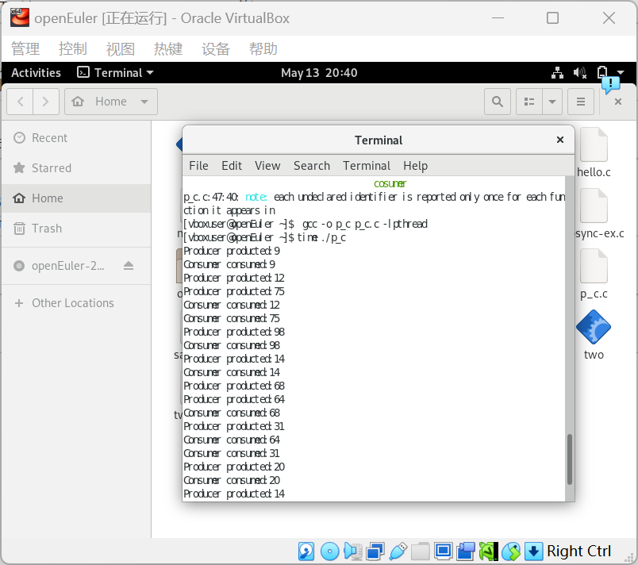

# 操作系统实验报告：线程同步问题实现

## 任务1：熟悉API

### 1.1 无同步机制的程序 (nosync-ex.c)

#### 代码实现
```c
#include <stdio.h>
#include <pthread.h>

int sum = 0;

void *thread(void* arg) {
    int i;
    for (i = 0; i < 1000000; i++)
        sum += 1;
    return NULL;
}

int main(void) {
    pthread_t tid1, tid2;
    pthread_create(&tid1, NULL, thread, NULL);
    pthread_create(&tid2, NULL, thread, NULL);
    pthread_join(tid1, NULL);
    pthread_join(tid2, NULL);
    printf("1000000 + 1000000 = %d\n", sum);
    return 0;
}
```

#### 执行结果


### 1.2 使用互斥锁的程序 (mutex-ex.c)

#### 代码实现
```c
#include <stdio.h>
#include <pthread.h>

int sum = 0;
pthread_mutex_t mutex;

void *thread(void* arg) {
    int i;
    for (i = 0; i < 1000000; i++) {
        pthread_mutex_lock(&mutex);
        sum += 1;
        pthread_mutex_unlock(&mutex);
    }
    return NULL;
}

int main(void) {
    pthread_t tid1, tid2;
    pthread_mutex_init(&mutex, NULL);

    pthread_create(&tid1, NULL, thread, NULL);
    pthread_create(&tid2, NULL, thread, NULL);
    pthread_join(tid1, NULL);
    pthread_join(tid2, NULL);
    printf("1000000 + 1000000 = %d\n", sum);
    pthread_mutex_destroy(&mutex);
    return 0;
}
```

#### 执行结果


### 1.3 使用信号量的程序 (sem-ex.c)

#### 代码实现
```c
#include <stdio.h>
#include <pthread.h>
#include <semaphore.h>

int sum = 0;
sem_t sem;

void *thread(void* arg) {
    int i;
    for (i = 0; i < 1000000; i++) {
        sem_wait(&sem);
        sum += 1;
        sem_post(&sem);
    }
    return NULL;
}

int main(void) {
    pthread_t tid1, tid2;
    sem_init(&sem, 0, 1);  

    pthread_create(&tid1, NULL, thread, NULL);
    pthread_create(&tid2, NULL, thread, NULL);
    pthread_join(tid1, NULL);
    pthread_join(tid2, NULL);
    printf("1000000 + 1000000 = %d\n", sum);
    sem_destroy(&sem);
    return 0;
}
```

#### 执行结果
 

注意参数arg的使用，不然会报错
**结论**：
1. 无同步机制的程序虽然执行快，但结果不可靠
2. 互斥锁和信号量都能保证正确性，但带来性能开销
3. 互斥锁更适合简单的临界区保护，信号量更适合复杂的同步场景

## 任务2：实现生产者消费者问题
### 问题分析
主要机制：
缓冲区：一个大小为 BUFFER_SIZE 的循环缓冲区（数组 buffer）。
指针in & out：
in：表示下一个生产位置。
out：表示下一个消费位置。
同步原理：
生产者：在缓冲区未满时生产，满了等待empty条件。
消费者：在缓冲区非空时消费，空了等待full条件。


流程：
生产者线程：

在每次生产前随机等待（模拟生产时间）。
通过pthread_mutex_lock()保证互斥。
如果缓冲区满（ (in + 1) % BUFFER_SIZE == out ），等待empty条件。
生成一个随机数放入缓冲区。
更新in指针。
使用pthread_cond_signal()通知消费方。
解锁互斥锁。

消费者线程：

类似，等待随机时间。
加锁，检查缓冲区是否为空（in == out），等待full条件。
取出数据，更新out指针。
通知生产者。
解锁互斥锁。
### 代码实现

```c
#include <pthread.h>
#include <semaphore.h>
#include <stdio.h>
#include<unistd.h>


#define BUFFER_SIZE 5
#define PRODUCT_NUM 10

int buffer[BUFFER_SIZE];
int in = 0;
int out = 0;

pthread_mutex_t mutex;
pthread_cond_t full;
pthread_cond_t empty;

// 通过互斥锁mutex和条件变量full、empty实现同步与互斥

void* producer(void* arg) {
    for (int i = 0; i < PRODUCT_NUM; i++) {
        usleep(rand() % 1000000);
        pthread_mutex_lock(&mutex);
        while ((in + 1) % BUFFER_SIZE == out) {
            pthread_cond_wait(&empty, &mutex);
        }
        buffer[in] = rand() % 100;
        printf("Producer produced: %d\n", buffer[in]);
        in = (in + 1) % BUFFER_SIZE;
        pthread_cond_signal(&full);
        pthread_mutex_unlock(&mutex);
    }
}

void* consumer(void* arg) {
    for (int i = 0; i < PRODUCT_NUM; i++) {
        usleep(rand() % 1000000);
        pthread_mutex_lock(&mutex);
        while (in == out) {
            pthread_cond_wait(&full, &mutex);
        }
        printf("Consumer consumed: %d\n", buffer[out]);
        out = (out + 1) % BUFFER_SIZE;
        pthread_cond_signal(&empty);
        pthread_mutex_unlock(&mutex);
    }
}

int main() {
    pthread_t producer_thread, consumer_thread;

    srand(time(NULL));

    // 创建生产者和消费者线程
    pthread_create(&producer_thread, NULL, producer, NULL);
    pthread_create(&consumer_thread, NULL, consumer, NULL);

    // 等待线程结束
    pthread_join(producer_thread, NULL);
    pthread_join(consumer_thread, NULL);

    return 0;
}
```

### 运行结果

## 任务3：代码阅读理解

### 3.1 pthread-ex01 分析
```c
#include <stdio.h>
#include <pthread.h>

void *thread(void *vargp) {
    pthread_exit((void *)42); // 线程退出并返回值42
}

int main(){
    int i;
    pthread_t tid;
    pthread_create(&tid, NULL, thread, NULL); // 创建线程
    pthread_join(tid, (void **)&i); // 等待线程结束并获取返回值
    
    printf ("%d\n", i); // 输出42
    return 0;
}
```
**分析**：该程序展示了如何通过pthread_exit()传递线程返回值，并通过pthread_join()获取返回值。

### 3.2 pthread-ex02 分析
```c
#include <stdio.h>
#include <stdlib.h>
#include <pthread.h>

void *thread(void *vargp) {
    exit(42); // 使用exit会终止整个进程
}

int main(){
    int i;
    pthread_t tid;
    pthread_create(&tid, NULL, thread, NULL);
    pthread_join(tid, (void **)&i); // 不会执行到这里
    
    printf ("%d\n", i); // 不会执行
    return 0;
}
```
**分析**：调用 exit()会终止程序而不是返回线程的状态。
在多线程程序中，若希望子线程退出且不影响其他线程，应使用 pthread_exit() 而非 exit()。

### 3.3 pthread-ex03 分析
```c
#include <stdio.h>
#include <pthread.h>

void *thread(void *vargp) {
    int *ptr = (int*)vargp;
    pthread_exit((void*)*ptr); // 返回传入的值42
}
void *thread2(void *vargp) {
    int *ptr = (int*)vargp;
    *ptr = 0; // 修改共享变量为0
    pthread_exit((void*)31); // 返回31
}

int main() {
    int i = 42;
    pthread_t tid, tid2;
    pthread_create(&tid, NULL, thread, (void*)&i);
    pthread_create(&tid2, NULL, thread2, (void*)&i);
    pthread_join(tid, (void**)&i); // i接收线程1的返回值42
    pthread_join(tid2, NULL); // 忽略线程2的返回值
    printf("%d\n",i); // 输出42
}
```
**分析**：这个程序成功演示了：
线程返回值的传递（通过pthread_exit()和pthread_join()）。
共享变量的修改（thread2中将i设为0，但这对最终的输出没有影响，因为i已经被更新为线程1的返回值）。
最终输出42。
### 3.4 pthread-ex04 分析
```c
#include <stdio.h>
#include <stdlib.h>
#include <pthread.h>

void *thread(void *vargp) {
    pthread_detach(pthread_self()); // 分离线程
    pthread_exit((void*)42); // 返回42
}

int main() {
    int i = 0;
    pthread_t tid;
    pthread_create(&tid, NULL, thread, (void*)&i);
    pthread_join(tid, (void**)&i); // 尝试join已分离的线程
    printf("%d\n",i); // 行为未定义
}
```
**分析**：分离的线程不能被pthread_join()：
一旦调用pthread_detach()，该线程的资源由系统自动回收。
调用pthread_join()会导致行为未定义，可能会导致程序崩溃或者不可预料的结果。

### 3.5 pthread-ex05 分析
```c
#include <stdio.h>
#include <pthread.h>

int i = 42; // 全局变量
void *thread(void *vargp) {
    printf("%d\n",i); // 可能输出42或31
}
void *thread2(void *vargp) {
    i = 31; // 修改全局变量
}

int main() {
    pthread_t tid, tid2;
    pthread_create(&tid2, NULL, thread2, (void*)&i);
    pthread_create(&tid, NULL, thread, (void*)&i);
    pthread_join(tid, (void**)&i);
    pthread_join(tid2, NULL);
}
```
**分析**：竞态条件：无同步机制导致thread看到的i值未定义，且可能受thread2的修改影响。
pthread_join()使用错误：
thread没有返回值，应传递NULL或确保有返回值，否则行为未定义。
输出具有随机性和不确定性，尤其在多核环境中。

### 3.6 pthread-ex06 分析
```c
#include <stdio.h>
#include <stdlib.h>
#include <pthread.h>

void *foo(void *vargp) {
    int myid = *((int *)vargp);
    free(vargp); // 释放动态分配的内存
    printf("Thread %d\n", myid);
}

int main() {
    pthread_t tid[2];
    for (int i = 0; i < 2; i++) {
        int *ptr = malloc(sizeof(int));
        *ptr = i;
        pthread_create(&tid[i], 0, foo, ptr); // 为每个线程分配独立内存
    }
    pthread_join(tid[0], 0);
    pthread_join(tid[1], 0);
}
```
**分析**：这是一个正确且典型的多线程参数传递和内存管理示例。
正确地为每个线程分配独立的内存，线程中释放，避免了悬挂指针和内存泄漏。

### 3.7 pthread-ex07 分析
```c
#include <stdio.h>
#include <stdlib.h>
#include <pthread.h>

void *foo(void *vargp) {
    int myid = *((int *)vargp); // 共享变量i的地址
    printf("Thread %d\n", myid); // 可能输出0,1或1,1
}

int main() {
    pthread_t tid[2];
    int i;
    for (i = 0; i < 2; i++) {
        pthread_create(&tid[i], 0, foo, &i); // 传递局部变量地址
    }
    pthread_join(tid[0], 0);
    pthread_join(tid[1],0);
}
```
**分析**：两个线程共享局部变量i的地址，可能导致数据竞争和不可预测的输出。

## 任务4：理发师问题实现

### 问题分析

理发师问题需要协调：
核心思想：
理发师（barber）线程：如果没有等待的客户，睡觉（等待条件变量 barber_sleep）；有客户时，帮其理发。
客户（customer）线程：如果有空椅子，加入等待队列，否则离开；如果加入等待，唤醒理发师。

关键变量：
waiting_customers: 当前等待的客户数。
mutex: 保护共享资源 waiting_customers。
条件变量 barber_sleep：理发师等待客户到来时使用。
条件变量 customer_wait：未在代码中使用，可能是冗余。

具体流程：
理发师：
在无限循环中等待客户（pthread_cond_wait）。
唤醒后，减少等待客户数，模拟理发。
客户：
核心逻辑是在检测等待区是否有空椅子（waiting_customers < NUM_CHAIRS）。
若有空椅子，加入等待队列（waiting_customers++）并唤醒理发师（pthread_cond_signal）。
否则离开（打印“Customer leaves...”）。

### 代码实现

```c
#include <pthread.h>
#include <stdio.h>
#include <stdlib.h>
#include <unistd.h>

#define NUM_CHAIRS 5

pthread_mutex_t mutex = PTHREAD_MUTEX_INITIALIZER;
pthread_cond_t barber_sleep = PTHREAD_COND_INITIALIZER;
pthread_cond_t customer_wait = PTHREAD_COND_INITIALIZER;

int waiting_customers = 0;

void* barber(void* arg) {
    while (1) {
        pthread_mutex_lock(&mutex);

        while (waiting_customers == 0) {
            printf("Barber is sleeping...\n");
            pthread_cond_wait(&barber_sleep, &mutex);
        }

        printf("Barber is cutting hair...\n");
        waiting_customers--;

        pthread_mutex_unlock(&mutex);

        sleep(rand() % 3 + 1);
    }
}

void* customer(void* arg) {
    pthread_mutex_lock(&mutex);

    if (waiting_customers < NUM_CHAIRS) {
        waiting_customers++;
        printf("Customer takes a seat. Total waiting: %d\n", waiting_customers);

        pthread_cond_signal(&barber_sleep);

        pthread_mutex_unlock(&mutex);

        sleep(rand() % 5 + 1);
    } else {
        printf("Customer leaves because no available chairs.\n");
        pthread_mutex_unlock(&mutex);
    }

    pthread_exit(NULL);
}

int main() {
    pthread_t barber_thread, customer_threads[NUM_CHAIRS + 5];
    srand(time(NULL));
    pthread_create(&barber_thread, NULL, barber, NULL);
    for (int i = 0; i < NUM_CHAIRS + 5; i++) {
        pthread_create(&customer_threads[i], NULL, customer, NULL);
    }
    pthread_join(barber_thread, NULL);
    for (int i = 0; i < NUM_CHAIRS + 5; i++) {
        pthread_join(customer_threads[i], NULL);
    }
    return 0;
}

```
### 结果


## 实验总结

实验过程中使用git进行版本控制，详细记录了代码和报告的修改过程。
通过本次实验，掌握了pthread多线程编程的基本方法；理解了互斥锁、信号量等同步机制的原理和应用；成功实现了经典的生产者消费者问题和理发师问题；加深了对线程同步和并发控制的理解。

