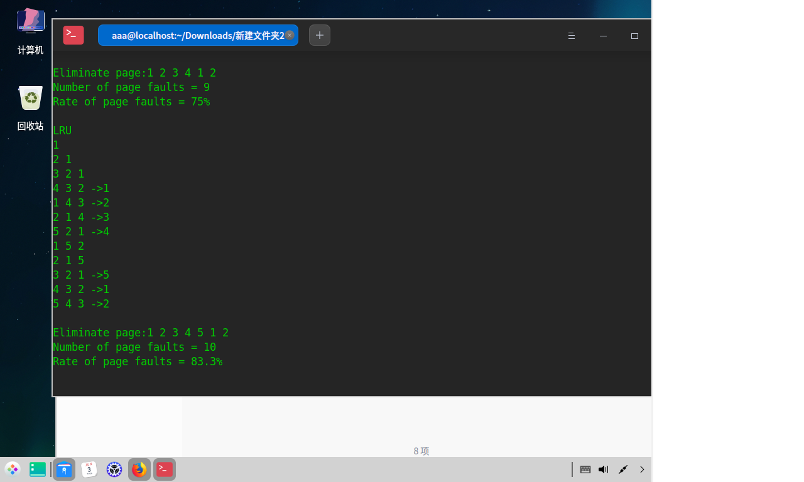
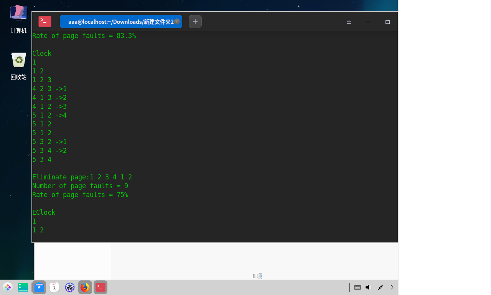
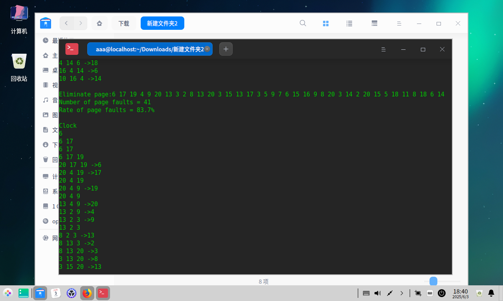
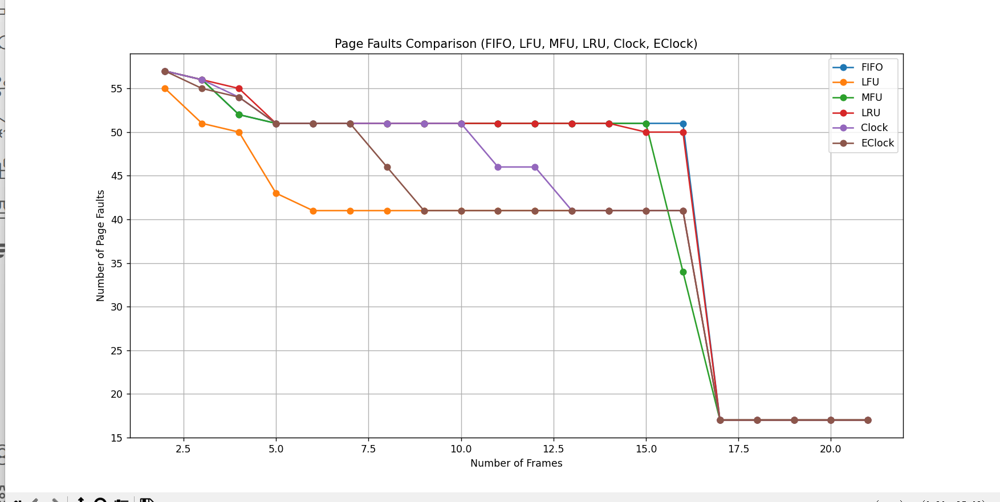

# oslab 05

软件2306 刘慈 20232241138

## 时钟（二次机会）置换算法

```c++
void Replace::Clock(void) {
    InitSpace("Clock");
    int pointer = 0;                     // 指向下一个要替换的页面
    bool* used = new bool[FrameNumber];  // 用于记录页面是否被访问过
    int eliminateIndex = 0;              // 用于记录淘汰页的索引

    for (int i = 0; i < FrameNumber; i++) {
        used[i] = false;
    }

    for (int k = 0; k < PageNumber; k++) {
        int next = ReferencePage[k];
        bool found = false;

        // 检查页面是否在帧中
        for (int i = 0; i < FrameNumber; i++) {
            if (PageFrames[i] == next) {
                found = true;
                used[i] = true;  // 将页面标记为已访问
                break;
            }
        }

        if (!found) {
            FaultNumber++;
            // 找到一个没有被访问过的页面进行替换
            while (used[pointer]) {
                used[pointer] = false;
                pointer = (pointer + 1) % FrameNumber;
            }

            // 记录被淘汰的页面
            if (PageFrames[pointer] != -1) {
                EliminatePage[eliminateIndex++] = PageFrames[pointer];
            }

            // 进行页面替换
            PageFrames[pointer] = next;
            used[pointer] = true;
            pointer = (pointer + 1) % FrameNumber;
        }

        // 报告当前实存中页号
        for (int j = 0; j < FrameNumber; j++) {
            if (PageFrames[j] >= 0)
                cout << PageFrames[j] << " ";
        }
        if (!found && eliminateIndex > 0 &&
            EliminatePage[eliminateIndex - 1] > 0)
            cout << "->" << EliminatePage[eliminateIndex - 1] << endl;
        else
            cout << endl;
    }

    delete[] used;
    Report();
}
```

## 增强二次机会置换算法

```c++
void Replace::Eclock(void) {
    InitSpace("EClock");
    int pointer = 0;                     // 指向下一个要替换的页面
    bool* used = new bool[FrameNumber];  // 用于记录页面是否被访问过
    bool* modified = new bool[FrameNumber];  // 用于记录页面是否被修改过
    int eliminateIndex = 0;                  // 用于记录淘汰页的索引

    for (int i = 0; i < FrameNumber; i++) {
        used[i] = false;
        modified[i] = false;
    }

    for (int k = 0; k < PageNumber; k++) {
        int next = ReferencePage[k];
        bool found = false;

        // 检查页面是否在帧中
        for (int i = 0; i < FrameNumber; i++) {
            if (PageFrames[i] == next) {
                found = true;
                used[i] = true;      // 将页面标记为已访问
                modified[i] = true;  // 假设页面被访问时也被修改
                break;
            }
        }

        if (!found) {
            FaultNumber++;
            // 找到一个没有被访问过的页面进行替换
            while (used[pointer] || modified[pointer]) {
                if (used[pointer]) {
                    used[pointer] = false;
                } else if (modified[pointer]) {
                    modified[pointer] = false;
                    used[pointer] = true;  // 第二次机会
                }
                pointer = (pointer + 1) % FrameNumber;
            }

            // 记录被淘汰的页面
            if (PageFrames[pointer] != -1) {
                EliminatePage[eliminateIndex++] = PageFrames[pointer];
            }

            // 进行页面替换
            PageFrames[pointer] = next;
            used[pointer] = true;
            modified[pointer] = false;  // 新页面假设未被修改
            pointer = (pointer + 1) % FrameNumber;
        }

        // 报告当前实存中页号
        for (int j = 0; j < FrameNumber; j++) {
            if (PageFrames[j] >= 0)
                cout << PageFrames[j] << " ";
        }
        if (!found && eliminateIndex > 0 &&
            EliminatePage[eliminateIndex - 1] > 0)
            cout << "->" << EliminatePage[eliminateIndex - 1] << endl;
        else
            cout << endl;
    }

    delete[] used;
    delete[] modified;
    Report();
}
```

## 最不经常使用置换算法

```c++
void Replace::Lfu(void) {
    InitSpace("LFU");
    int* frequency = new int[FrameNumber];  // 记录每个页面的使用频率
    int eliminateIndex = 0;                 // 用于记录淘汰页的索引

    for (int i = 0; i < FrameNumber; i++) {
        frequency[i] = 0;
    }

    for (int k = 0; k < PageNumber; k++) {
        int next = ReferencePage[k];
        bool found = false;

        // 检查页面是否在帧中
        for (int i = 0; i < FrameNumber; i++) {
            if (PageFrames[i] == next) {
                found = true;
                frequency[i]++;  // 增加页面的使用频率
                break;
            }
        }

        if (!found) {
            FaultNumber++;
            // 找到使用频率最低的页面进行替换
            int minFreqIndex = 0;
            for (int i = 1; i < FrameNumber; i++) {
                if (frequency[i] < frequency[minFreqIndex]) {
                    minFreqIndex = i;
                }
            }

            // 记录被淘汰的页面
            if (PageFrames[minFreqIndex] != -1) {
                EliminatePage[eliminateIndex++] = PageFrames[minFreqIndex];
            }

            // 进行页面替换
            PageFrames[minFreqIndex] = next;
            frequency[minFreqIndex] = 1;  // 新页面初始使用频率为1
        }

        // 报告当前实存中页号
        for (int j = 0; j < FrameNumber; j++) {
            if (PageFrames[j] >= 0)
                cout << PageFrames[j] << " ";
        }
        if (!found && eliminateIndex > 0 &&
            EliminatePage[eliminateIndex - 1] > 0)
            cout << "->" << EliminatePage[eliminateIndex - 1] << endl;
        else
            cout << endl;
    }

    delete[] frequency;
    Report();
}
```

## 最经常使用置换算法

```c++
void Replace::Mfu(void) {
    InitSpace("MFU");
    int* frequency = new int[FrameNumber];  // 记录每个页面的使用频率
    int eliminateIndex = 0;                 // 用于记录淘汰页的索引

    for (int i = 0; i < FrameNumber; i++) {
        frequency[i] = 0;
    }

    for (int k = 0; k < PageNumber; k++) {
        int next = ReferencePage[k];
        bool found = false;

        // 检查页面是否在帧中
        for (int i = 0; i < FrameNumber; i++) {
            if (PageFrames[i] == next) {
                found = true;
                frequency[i]++;  // 增加页面的使用频率
                break;
            }
        }

        if (!found) {
            FaultNumber++;
            // 找到使用频率最高的页面进行替换
            int maxFreqIndex = 0;
            for (int i = 1; i < FrameNumber; i++) {
                if (frequency[i] > frequency[maxFreqIndex]) {
                    maxFreqIndex = i;
                }
            }

            // 记录被淘汰的页面
            if (PageFrames[maxFreqIndex] != -1) {
                EliminatePage[eliminateIndex++] = PageFrames[maxFreqIndex];
            }

            // 进行页面替换
            PageFrames[maxFreqIndex] = next;
            frequency[maxFreqIndex] = 1;  // 新页面初始使用频率为1
        }

        // 报告当前实存中页号
        for (int j = 0; j < FrameNumber; j++) {
            if (PageFrames[j] >= 0)
                cout << PageFrames[j] << " ";
        }
        if (!found && eliminateIndex > 0 &&
            EliminatePage[eliminateIndex - 1] > 0)
            cout << "->" << EliminatePage[eliminateIndex - 1] << endl;
        else
            cout << endl;
    }

    delete[] frequency;
    Report();
}
```

## 结果






## 生成随机内存引用串

为了测试页置换算法，编写 `shell` 脚本生成 `n` 个 20 以内的随机数作为内存引用串

```shell
#!/bin/bash

n=$((RANDOM % 100 + 1))

numbers=()
for (( i=0; i<n; i++ ))
do
    numbers+=($((RANDOM % 20 + 1)))
done

echo "100以内随机正整数 n: $n"
echo "随机内存引用串: ${numbers[@]}"

./vmrp <<EOF
$n
${numbers[@]}
3
EOF
```




命中率的排序是： LRU > LFU > Eclock > Clock > FIFO > MFU

## 绘图分析

绘制FIFO页面置换算法的曲线图展示Belady异常

```python
import matplotlib.pyplot as plt

# 页面访问序列
reference_string = [
    0, 1, 2, 0, 3, 4, 2, 1, 2, 0, 3, 4, 5, 6, 7, 8, 9, 10, 11, 12, 13, 14, 15, 16,
    0, 1, 2, 3, 4, 5, 6, 7, 8, 9, 10, 11, 12, 13, 14, 15, 16, 0, 1, 2, 3, 4, 5, 6, 7, 8, 9, 10, 11, 12, 13, 14, 15, 16
]
# 页面数量
num_frames = list(range(2, 22))  # 从2到21，共20个数据点

# 初始化结果存储
results = {
    'FIFO': [],
    'LFU': [],
    'MFU': [],
    'LRU': [],
    'Clock': [],
    'EClock': []
}

# FIFO算法
def fifo_algorithm(frames, reference_string):
    page_faults = 0
    current_frames = []
    for page in reference_string:
        if page not in current_frames:
            page_faults += 1
            if len(current_frames) < frames:
                current_frames.append(page)
            else:
                current_frames.pop(0)
                current_frames.append(page)
    return page_faults

# LFU算法
def lfu_algorithm(frames, reference_string):
    page_faults = 0
    current_frames = []
    frequency = {}
    for page in reference_string:
        if page not in current_frames:
            page_faults += 1
            if len(current_frames) < frames:
                current_frames.append(page)
                frequency[page] = 1
            else:
                min_freq = float('inf')
                min_page = None
                for frame in current_frames:
                    if frequency[frame] < min_freq:
                        min_freq = frequency[frame]
                        min_page = frame
                current_frames.remove(min_page)
                del frequency[min_page]
                current_frames.append(page)
                frequency[page] = 1
        else:
            frequency[page] += 1
    return page_faults

# MFU算法
def mfu_algorithm(frames, reference_string):
    page_faults = 0
    current_frames = []
    frequency = {}
    for page in reference_string:
        if page not in current_frames:
            page_faults += 1
            if len(current_frames) < frames:
                current_frames.append(page)
                frequency[page] = 1
            else:
                max_freq = -1
                max_page = None
                for frame in current_frames:
                    if frequency[frame] > max_freq:
                        max_freq = frequency[frame]
                        max_page = frame
                current_frames.remove(max_page)
                del frequency[max_page]
                current_frames.append(page)
                frequency[page] = 1
        else:
            frequency[page] += 1
    return page_faults

# LRU算法
def lru_algorithm(frames, reference_string):
    page_faults = 0
    current_frames = []
    access_order = []  # 用于记录页面的访问顺序
    for page in reference_string:
        if page not in current_frames:
            page_faults += 1
            if len(current_frames) < frames:
                current_frames.append(page)
                access_order.append(page)
            else:
                # 替换最久未访问的页面
                oldest_page = access_order.pop(0)
                current_frames.remove(oldest_page)
                current_frames.append(page)
                access_order.append(page)
        else:
            # 更新访问顺序
            access_order.remove(page)
            access_order.append(page)
    return page_faults

# Clock算法
def clock_algorithm(frames, reference_string):
    page_faults = 0
    current_frames = []
    used = {}
    pointer = 0
    for page in reference_string:
        if page not in current_frames:
            page_faults += 1
            if len(current_frames) < frames:
                current_frames.append(page)
                used[page] = False
            else:
                while used[current_frames[pointer]]:
                    used[current_frames[pointer]] = False
                    pointer = (pointer + 1) % frames
                removed_page = current_frames.pop(pointer)
                del used[removed_page]
                current_frames.insert(pointer, page)
                used[page] = False
                pointer = (pointer + 1) % frames
        else:
            used[page] = True
    return page_faults

# EClock算法
def eclock_algorithm(frames, reference_string):
    page_faults = 0
    current_frames = []
    used = {}
    modified = {}
    pointer = 0
    for page in reference_string:
        if page not in current_frames:
            page_faults += 1
            if len(current_frames) < frames:
                current_frames.append(page)
                used[page] = False
                modified[page] = False
            else:
                while used[current_frames[pointer]] or modified[current_frames[pointer]]:
                    if used[current_frames[pointer]]:
                        used[current_frames[pointer]] = False
                    elif modified[current_frames[pointer]]:
                        modified[current_frames[pointer]] = False
                        used[current_frames[pointer]] = True
                    pointer = (pointer + 1) % frames
                removed_page = current_frames.pop(pointer)
                del used[removed_page]
                del modified[removed_page]
                current_frames.insert(pointer, page)
                used[page] = False
                modified[page] = False
                pointer = (pointer + 1) % frames
        else:
            used[page] = True
            modified[page] = True
    return page_faults

# 计算每种算法在不同页面帧数量下的页面置换次数
for frames in num_frames:
    results['FIFO'].append(fifo_algorithm(frames, reference_string))
    results['LFU'].append(lfu_algorithm(frames, reference_string))
    results['MFU'].append(mfu_algorithm(frames, reference_string))
    results['LRU'].append(lru_algorithm(frames, reference_string))
    results['Clock'].append(clock_algorithm(frames, reference_string))
    results['EClock'].append(eclock_algorithm(frames, reference_string))

# 绘制曲线图
plt.figure(figsize=(14, 7))
for algorithm, page_faults in results.items():
    plt.plot(num_frames, page_faults, marker='o', linestyle='-', label=algorithm)

plt.title('Page Faults Comparison (FIFO, LFU, MFU, LRU, Clock, EClock)')
plt.xlabel('Number of Frames')
plt.ylabel('Number of Page Faults')
plt.legend()
plt.grid(True)
plt.show()
```



## 模拟过程分析

### 二次机会算法

1. 初始化：
    `InitSpace("Clock");`：用于初始化页面帧数组`PageFrames`
    创建一个布尔数组 used，用于记录每个页面框中的页面是否被访问过。
    初始化指针 pointer，指向下一个要替换的页面框。
2. 页面访问：
     `bool* used = new bool[FrameNumber];`：这个布尔数组用于记录页面是否被访问过
     `int eliminateIndex = 0;`：用于记录被淘汰页面的索引。
    遍历页面访问序列 ReferencePage。
    对于每个页面 next：
        如果页面已经在页面框中，标记为已访问（used[i] = true）。
        如果页面不在页面框中，触发页面置换：
            从指针指向的页面框开始，检查 used 标志。
            如果页面框中的页面被访问过（used[pointer] == true），清除访问标志（used[pointer] = false），并将指针移动到下一个页面框。
            如果找到一个未被访问的页面框（used[pointer] == false），替换该页面框中的页面为新页面，并标记为已访问（used[pointer] = true）。
            移动指针到下一个页面框。
3. 输出
        每次页面访问后，输出当前页面框中的页面。
        如果发生页面置换，输出被淘汰的页面。
4. 程序结束时，释放`used`数组，并调用`Report()`函数报告结果增强二次机会算法

### 增强二次机会算法

1. 初始化：
   `InitSpace("EClock");`：用于初始化页面帧数组`PageFrames`
    创建两个布尔数组 used 和 modified，分别记录每个页面框中的页面是否被访问过和是否被修改过。
    初始化指针 pointer，指向下一个要替换的页面框。
2. 页面访问：
     `bool* used = new bool[FrameNumber];`：这个布尔数组用于记录页面是否被访问过
     `bool* modified = new bool[FrameNumber]`：这个布尔数组用于记录是否被修改过（`modified`）
    循环初始化`used`和`modified`数组，将所有页面标记为未访问和未修改
    遍历页面访问序列 ReferencePage。
    对于每个页面 next：
        如果页面已经在页面框中，标记为已访问（used[i] = true）并假设页面被修改（modified[i] = true）。
        如果页面不在页面框中，触发页面置换：
            从指针指向的页面框开始，检查 used 和 modified 标志。
            如果页面框中的页面被访问过（used[pointer] == true），清除访问标志（used[pointer] = false）。
            如果页面框中的页面未被访问过但被修改过（modified[pointer] == true），清除修改标志（modified[pointer] = false），并将访问标志设置为 true（给予第二次机会）。
            如果找到一个未被访问且未被修改的页面框（used[pointer] == false 且 modified[pointer] == false），替换该页面框中的页面为新页面，并标记为已访问（used[pointer] = true）。
            移动指针到下一个页面框。
3. 输出
        每次页面访问后，输出当前页面框中的页面。
        如果发生页面置换，输出被淘汰的页面。
4. 程序结束时，释放`used`数组，并调用`Report()`函数报告结果

### 最不经常使用置换算法 

1. 初始化：
   `InitSpace("LFU");`：用于初始化页面帧数组`PageFrames`
   `int* frequency = new int[FrameNumber];`：创建一个整型数组来记录每个页面的使用频率 `int eliminateIndex = 0;`：用于记录被淘汰页面的索引
   初始化`frequency`数组，将所有页面的使用频率设置为0
2. 页面访问：
    外层循环遍历所有页面引用（`PageNumber`）：
    循环初始化used 数组，将所有页面标记为未访问
    对于每个页面 next：
        如果页面已经在页面框中，增加该页面的使用频率（frequency[i]++）。
        如果页面不在页面框中，触发页面置换：
            找到使用频率最低的页面框（minFreqIndex）。
            记录被淘汰页面的编号，如果该页面编号不是-1
            将minFreqIndex位置的页面替换为新页面next
            将新页面的使用频率设置为1，因为新页面被访问了一次
3. 输出
        每次页面访问后，输出当前页面框中的页面。
        如果发生页面置换，输出被淘汰的页面。
4. 程序结束时，释放`frequency`数组，并调用`Report()`函数报告结果

### 最经常使用置换算法

1. 初始化：
   `InitSpace("MFU");`：用于初始化页面帧数组`PageFrames`
    `int* frequency = new int[FrameNumber];`：创建一个整型数组来记录每个页面的使用频率
    `int eliminateIndex = 0;`：用于记录被淘汰页面的索引
    初始化`frequency`数组，将所有页面的使用频率设置为0
2. 页面访问：
    外层循环遍历所有页面引用（`PageNumber`）：
    对于每个页面 next：
    如果页面已经在页面框中，增加该页面的使用频率（frequency[i]++）。
    如果页面不在页面框中，触发页面置换：
        找到使用频率最高的页面框（maxFreqIndex）。
        记录被淘汰页面的编号，如果该页面编号不是-1
        将maxFreqIndex 位置的页面替换为新页面next
        将新页面的使用频率设置为1，因为新页面被访问了一次
3. 输出
        每次页面访问后，输出当前页面框中的页面。
        如果发生页面置换，输出被淘汰的页面。
4. 程序结束时，释放`frequency`数组，并调用`Report()`函数报告结果

## 算法适用场景

### LRU（最近最少使用）算法

- **逻辑**：淘汰最长时间未被访问的页面。通过维护一个访问时间列表或队列来记录页面的访问顺序。每次访问页面时，将该页面移到队列的末尾；当需要置换页面时，选择队列头部的页面进行替换。
- **适用场景**：
  - **页面引用串特点**：适用于页面访问具有较强的时间局部性的情况，即最近访问过的页面在未来一段时间内可能还会被访问。
  - **内存帧数**：对内存帧数没有特别的限制，但在内存帧数较少时，LRU 的效果可能更明显，因为它能够更好地利用有限的内存资源，避免频繁的页面置换。

### FIFO（先进先出）算法

- **逻辑**：淘汰最早进入内存的页面。维护一个队列，页面按照进入内存的顺序排列。当需要置换页面时，选择队列头部的页面进行替换。
- **适用场景**：
  - **页面引用串特点**：适用于页面访问顺序较为均匀，没有明显的时间局部性的情况。
  - **内存帧数**：在内存帧数较多时，FIFO 的表现可能较好，因为有足够的空间容纳更多的页面，减少了页面置换的频率。

### CLOCK（时钟）算法

- **逻辑**：一种改进的 FIFO 算法，引入了一个访问位（used）来记录页面是否被访问过。算法使用一个循环队列（类似时钟）来管理页面。当需要置换页面时，从指针指向的位置开始，检查访问位，如果页面被访问过，则清除访问位并移动指针；如果页面未被访问过，则替换该页面。
- **适用场景**：
  - **页面引用串特点**：适用于页面访问具有一定的局部性，但又不像 LRU 那样明显的情况。它能够在一定程度上避免 FIFO 算法可能出现的 Belady 异常。
  - **内存帧数**：在内存帧数适中时表现较好，因为它在 FIFO 的基础上增加了访问位的检查，能够更好地利用有限的内存资源。

### ECLOCK（增强时钟）算法

- **逻辑**：在 CLOCK 算法的基础上增加了修改位（modified），用于记录页面是否被修改过。当需要置换页面时，优先选择未被修改且未被访问过的页面进行替换。如果所有页面都被修改过或访问过，则给予页面第二次机会，清除修改位或访问位，继续查找。
- **适用场景**：
  - **页面引用串特点**：适用于页面访问具有一定的局部性，且页面修改操作较为频繁的情况。它能够更好地处理修改过的页面，避免不必要的写入操作。
  - **内存帧数**：在内存帧数适中时表现较好，因为它在 CLOCK 算法的基础上增加了对修改位的处理，能够更好地适应复杂的页面访问模式。

### LFU（最不经常使用）算法

- **逻辑**：淘汰使用频率最低的页面。通过记录每个页面的使用频率，当需要置换页面时，选择使用频率最低的页面进行替换。
- **适用场景**：
  - **页面引用串特点**：适用于页面访问具有一定的频率局部性的情况，即某些页面被频繁访问，而另一些页面很少被访问。
  - **内存帧数**：在内存帧数较多时表现较好，因为有足够的空间容纳更多的页面，能够更好地记录页面的使用频率。

### MFU（最经常使用）算法

- **逻辑**：淘汰使用频率最高的页面。通过记录每个页面的使用频率，当需要置换页面时，选择使用频率最高的页面进行替换。
- **适用场景**：
  - **页面引用串特点**：适用于页面访问具有明显的频率局部性的情况，即某些页面被非常频繁地访问，而其他页面很少被访问。这种算法假设使用频率高的页面在未来可能还会被频繁访问。
  - **内存帧数**：在内存帧数较多时表现较好，因为有足够的空间容纳更多的页面，能够更好地记录页面的使用频率。

### 总结

- **LRU**：适用于具有较强时间局部性的页面访问序列，对内存帧数没有特别限制。
- **FIFO**：适用于页面访问顺序较为均匀的情况，内存帧数较多时表现较好。
- **CLOCK**：适用于具有一定局部性的页面访问序列，内存帧数适中时表现较好。
- **ECLOCK**：适用于页面访问具有局部性且页面修改操作频繁的情况，内存帧数适中时表现较好。
- **LFU**：适用于具有频率局部性的页面访问序列，内存帧数较多时表现较好。
- **MFU**：适用于具有明显频率局部性的页面访问序列，内存帧数较多时表现较好。

在实际应用中，选择哪种算法取决于具体的页面访问模式和系统资源情况。通常，LRU 和 CLOCK 算法因其较好的性能和实现简单性而被广泛使用。

## 心得体会

报告中详细描述了几种常见的页面置换算法：时钟（二次机会）算法、增强二次机会算法、最不经常使用（LFU）算法和最经常使用（MFU）算法。每种算法都通过特定的逻辑来决定哪个页面应该被置换出内存。这些算法各有优势和适用场景，选择哪种算法取决于具体的页面访问模式和系统资源情况。在实际应用中，LRU 和 CLOCK 算法因其较好的性能和实现简单性而被广泛使用。然而，LRU 算法的实现可能需要更多的内存来记录每个页面的访问时间，而 CLOCK 算法则相对简单且易于实现。对于具有特定访问模式的系统，如数据库系统或 Web 服务器，可能需要根据实际的页面访问模式来定制或调整页面置换算法，以获得最佳的性能。在设计页面置换算法时，还需要考虑算法的复杂性和实现的可行性，以及它们对系统性能的影响。

总的来说，这些页面置换算法提供了不同的策略来优化内存的使用，减少页面置换次数，从而提高系统的整体性能。在实际应用中，理解和选择合适的算法对于提高系统效率至关重要。

github仓库地址：https://github.com/lc-369/oslab.git