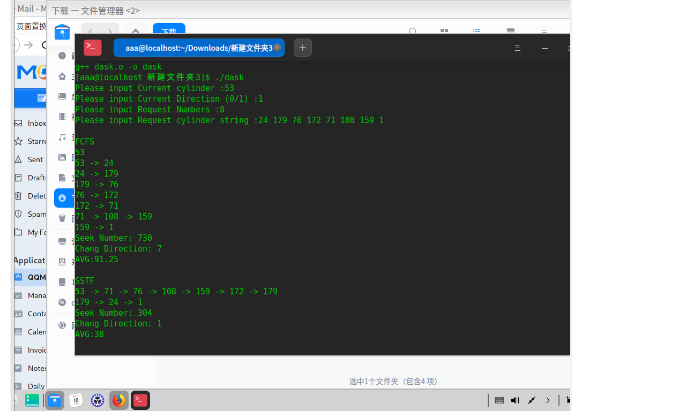
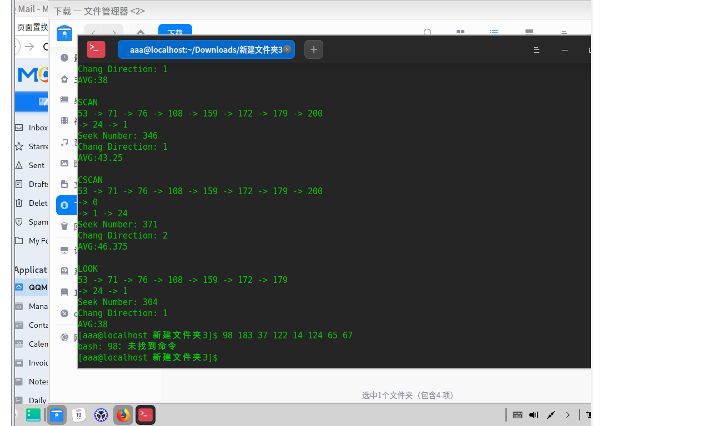

# oslab 06

软件2305 刘慈 20232241138

## 补全磁盘调度算法

```c++
/*
 * Filename : dask.cc
 * copyright : (C) 2006 by zhonghonglie
 * Function : 磁盘移臂调度算法
 */
#include "dask.h"
#include <cstdlib>
#include <ctime>
using namespace std;
DiskArm::DiskArm() {
    int i;
    // 输入当前道号
    cout << "Please input Current cylinder :";
    cin >> CurrentCylinder;
    // 磁头方向，输入 0 表示向小道号移动，1 表示向大道号移动
    cout << "Please input Current Direction (0/1) :";
    cin >> SeekDirection;
    // 输入磁盘请求数，请求道号
    cout << "Please input Request Numbers :";
    cin >> RequestNumber;
    cout << "Please input Request cylinder string :";
    Request = new int[sizeof(int) * RequestNumber];
    Cylinder = new int[sizeof(int) * RequestNumber];
    for (i = 0; i < RequestNumber; i++)
        cin >> Request[i];
    cout << endl;
}
DiskArm::~DiskArm() {}
// 初始化道号，寻道记录
void DiskArm::InitSpace(char* MethodName) {
    int i;
    cout << endl << MethodName << endl;
    SeekNumber = 0;
    SeekChang = 0;
    for (i = 0; i < RequestNumber; i++)
        Cylinder[i] = Request[i];
}
// 统计报告算法执行情况
void DiskArm::Report(void) {
    cout << endl;
    cout << "Seek Number: " << SeekNumber << endl;
    cout << "Chang Direction: " << SeekChang << endl;
    cout << "AVG:" << (float)SeekNumber / RequestNumber << endl;
}
// 先来先服务算法
void DiskArm::Fcfs(void) {
    int Current = CurrentCylinder;
    int Direction = SeekDirection;
    InitSpace("FCFS");
    cout << Current;
    for (int i = 0; i < RequestNumber; i++) {
        if (((Cylinder[i] >= Current) && !Direction) ||
            ((Cylinder[i] < Current) && Direction)) {
            // 需要调头
            SeekChang++;             // 调头数加 1
            Direction = !Direction;  // 改变方向标志
            // 报告当前响应的道号
            cout << endl << Current << " -> " << Cylinder[i];
        } else  // 不需调头，报告当前响应的道号
            cout << " -> " << Cylinder[i];
        // 累计寻道数，响应过的道号变为当前道号
        SeekNumber += abs(Current - Cylinder[i]);
        Current = Cylinder[i];
    }
    // 报告磁盘移臂调度的情况
    Report();
}
// 最短寻道时间优先算法
void DiskArm::Sstf(void) {
    int Shortest;
    int Distance = 999999;
    int Direction = SeekDirection;
    int Current = CurrentCylinder;
    InitSpace("SSTF");
    cout << Current;
    for (int i = 0; i < RequestNumber; i++) {
        // 查找当前最近道号
        for (int j = 0; j < RequestNumber; j++) {
            if (Cylinder[j] == -1)
                continue;  //-1 表示已经响应过了

            if (Distance > abs(Current - Cylinder[j])) {
                // 到下一道号比当前距离近，下一道号为当前距离
                Distance = abs(Current - Cylinder[j]);
                Shortest = j;
            }
        }
        if (((Cylinder[Shortest] >= Current) && !Direction) ||
            ((Cylinder[Shortest] < CurrentCylinder) && Direction)) {
            // 需要调头
            SeekChang++;             // 调头数加 1
            Direction = !Direction;  // 改变方向标志
            // 报告当前响应的道号
            cout << endl << Current << " -> " << Cylinder[Shortest];
        } else  // 不需调头，报告当前响应的道号
            cout << " -> " << Cylinder[Shortest];
        // 累计寻道数，响应过的道号变为当前道号
        SeekNumber += abs(Current - Cylinder[Shortest]);
        Current = Cylinder[Shortest];
        // 恢复最近距离，销去响应过的道号
        Distance = 999999;
        Cylinder[Shortest] = -1;
    }
    Report();
}

void sort(int* a, int n) {
    for (int i = 0; i < n - 1; i++) {
        for (int j = 0; j < n - i - 1; j++) {
            if (a[j] > a[j + 1]) {
                int temp = a[j + 1];
                a[j + 1] = a[j];
                a[j] = temp;
            }
        }
    }
}

// 电梯调度算法
void DiskArm::Scan(void) {
    int Current = CurrentCylinder;
    int Direction = SeekDirection;
    InitSpace("SCAN");
    int point = 0;
    for (int i = 0; i < RequestNumber; i++) {
        if (Cylinder[i] <= Current)
            point++;
    }  // 标记
    sort(Cylinder, RequestNumber);  // 升序排列
    cout << Current << " ";

    if (Direction == 0) {
        for (int i = point - 1; i >= 0; i--) {
            cout << "-> " << Cylinder[i] << " ";
        }
        cout << "->" << 0;
        SeekChang++;
        SeekNumber += abs(Current - 0);
        cout << endl;
        for (int i = point; i < RequestNumber; i++) {
            cout << "-> " << Cylinder[i] << " ";
        }
        SeekNumber += abs(Cylinder[RequestNumber - 1] - 0);
    }

    else if (Direction == 1) {
        for (int i = point; i < RequestNumber; i++) {
            cout << "-> " << Cylinder[i] << " ";
        }
        cout << "-> " << 200;
        SeekNumber += abs(200 - Current);
        SeekChang++;
        cout << endl;
        for (int i = point - 1; i >= 0; i--) {
            cout << "-> " << Cylinder[i] << " ";
        }
        SeekNumber += abs(200 - Cylinder[0]);
    }
    Report();
}

// 均匀电梯调度算法
void DiskArm::CScan(void) {
    int Current = CurrentCylinder;
    int Direction = SeekDirection;
    InitSpace("CSCAN");
    int point = 0;
    for (int i = 0; i < RequestNumber; i++) {
        if (Cylinder[i] <= Current)
            point++;
    }
    sort(Cylinder, RequestNumber);  // 升序排列
    cout << Current << " ";

    if (Direction == 0) {
        for (int i = point - 1; i >= 0; i--) {
            cout << "-> " << Cylinder[i] << " ";
        }
        cout << "-> " << 0;  // 向左到0
        cout << endl;
        cout << "-> " << 200;
        SeekChang++;
        SeekNumber += abs(Current - 0);  // 向左移动到0的距离
        SeekNumber += 200;               // 从0到200
        cout << endl;
        SeekChang++;
        for (int i = RequestNumber - 1; i >= point; i--) {
            cout << "-> " << Cylinder[i] << " ";
        }
        SeekNumber +=
            abs(200 - Cylinder[point + 1]);  // 200到最后一个访问点的距离
    }

    else if (Direction == 1) {
        for (int i = point; i < RequestNumber; i++) {
            cout << "-> " << Cylinder[i] << " ";
        }
        cout << "-> " << 200;
        cout << endl;
        cout << "-> " << 0;
        SeekNumber += abs(200 - Current) + 200;
        SeekChang++;
        cout << endl;
        SeekChang++;
        for (int i = 0; i <= point - 1; i++) {
            cout << "-> " << Cylinder[i] << " ";
        }
        SeekNumber += abs(Cylinder[point - 1] - 0);
    }
    Report();
}
// LOOK 调度算法
void DiskArm::Look(void) {
    int Current = CurrentCylinder;
    int Direction = SeekDirection;
    InitSpace("LOOK");
    int point = 0;
    for (int i = 0; i < RequestNumber; i++) {
        if (Cylinder[i] <= Current)
            point++;
    }
    sort(Cylinder, RequestNumber);  // 升序排列
    cout << Current << " ";

    if (Direction == 0) {
        for (int i = point - 1; i >= 0; i--) {
            cout << "-> " << Cylinder[i] << " ";
        }
        SeekChang++;
        SeekNumber += abs(Current - Cylinder[0]);
        cout << endl;
        for (int i = point; i < RequestNumber; i++) {
            cout << "-> " << Cylinder[i] << " ";
        }
        SeekNumber += abs(Cylinder[RequestNumber - 1] - Cylinder[0]);
    }

    else if (Direction == 1) {
        for (int i = point; i < RequestNumber; i++) {
            cout << "-> " << Cylinder[i] << " ";
        }
        SeekNumber += abs(Cylinder[RequestNumber - 1] - Current);
        SeekChang++;
        cout << endl;
        for (int i = point - 1; i >= 0; i--) {
            cout << "-> " << Cylinder[i] << " ";
        }
        SeekNumber += abs(Cylinder[RequestNumber - 1] - Cylinder[0]);
    }
    Report();
}

// 程序启动入口
int main(int argc, char* argv[]) {
    // 建立磁盘移臂调度类
    DiskArm* dask = new DiskArm();
    // 比较和分析 FCFS 和 SSTF 两种调度算法的性能
    dask->Fcfs();
    dask->Sstf();
    dask->Scan();
    dask->CScan();
    dask->Look();
}
```

输出结果如下：




### 改进 `DiskArm` 函数，使其能够*随机产生磁盘柱面请求序列*

```c++
DiskArm::DiskArm() {
    int i;
    // 输入当前道号
    cout << "Please input Current cylinder :";
    cin >> CurrentCylinder;
    // 磁头方向，输入 0 表示向小道号移动，1 表示向大道号移动
    cout << "Please input Current Direction (0/1) :";
    cin >> SeekDirection;
    // 输入磁盘请求数，请求道号
    cout << "Please input Request Numbers :";
    cin >> RequestNumber;
    cout << "Please input Request cylinder string :";
    Request = new int[sizeof(int) * RequestNumber];
    Cylinder = new int[sizeof(int) * RequestNumber];
    // 随机产生磁盘柱面请求序列
    srand(static_cast<unsigned>(time(0)));
    for (int i = 0; i < RequestNumber; i++) {
        // 假设磁道号范围为 0-199
        Request[i] = rand() % 200;
    }
    for (int j = 0; j < RequestNumber; j++) {
        cout << Request[j] << " ";
    }
    cout << endl;
}
```

### 进行测试：

#### 示例 1

```bash
Please input Current cylinder :100
Please input Current Direction (0/1) :1
Please input Request Numbers :7
Please input Request cylinder string :50 150 120 30 80 180 130

FCFS
100 -> 50
50 -> 150
150 -> 120
120 -> 30
30 -> 80
80 -> 180
180 -> 130
Seek Number: 540
Chang Direction: 6
AVG:77.143

SSTF
100
100 -> 80
80 -> 120
120 -> 130
130 -> 150
150 -> 180
180 -> 50
50 -> 30
Seek Number: 240
Chang Direction: 6
AVG:34.286

SCAN
100 -> 120
120 -> 130
130 -> 150
150 -> 180
180 -> 200
200 -> 180
180 -> 150
150 -> 120
120 -> 100
100 -> 80
80 -> 50
50 -> 30
Seek Number: 220
Chang Direction: 1
AVG:31.429

CSCAN
100 -> 120
120 -> 130
130 -> 150
150 -> 180
180 -> 200
200 -> 0
0 -> 30
30 -> 50
50 -> 80
Seek Number: 260
Chang Direction: 2
AVG:37.143

LOOK
100 -> 120
120 -> 130
130 -> 150
150 -> 180
180 -> 150
150 -> 120
120 -> 100
100 -> 80
80 -> 50
50 -> 30
Seek Number: 210
Chang Direction: 1
AVG:30
```

#### 示例 2

```bash
Please input Current cylinder :80
Please input Current Direction (0/1) :0
Please input Request Numbers :9
Please input Request cylinder string :20 10 150 140 130 120 110 100 90

FCFS
80 -> 20
20 -> 10
10 -> 150
150 -> 140
140 -> 130
130 -> 120
120 -> 110
110 -> 100
100 -> 90
Seek Number: 520
Chang Direction: 8
AVG:57.778

SSTF
80
80 -> 90
90 -> 100
100 -> 110
110 -> 120
120 -> 130
130 -> 140
140 -> 150
150 -> 20
20 -> 10
Seek Number: 220
Chang Direction: 8
AVG:24.444

SCAN
80 -> 70
70 -> 60
60 -> 50
50 -> 40
40 -> 30
30 -> 20
20 -> 10
10 -> 0
0 -> 10
10 -> 20
20 -> 30
30 -> 40
40 -> 50
50 -> 60
60 -> 70
70 -> 80
80 -> 90
90 -> 100
100 -> 110
110 -> 120
120 -> 130
130 -> 140
140 -> 150
Seek Number: 200
Chang Direction: 1
AVG:22.222

CSCAN
80 -> 70
70 -> 60
60 -> 50
50 -> 40
40 -> 30
30 -> 20
20 -> 10
10 -> 0
0 -> 200
200 -> 150
150 -> 140
140 -> 130
130 -> 120
120 -> 110
110 -> 100
100 -> 90
Seek Number: 240
Chang Direction: 2
AVG:26.667

LOOK
80 -> 70
70 -> 60
60 -> 50
50 -> 40
40 -> 30
30 -> 20
20 -> 10
10 -> 0
0 -> 10
10 -> 20
20 -> 30
30 -> 40
40 -> 50
50 -> 60
60 -> 70
70 -> 80
80 -> 90
90 -> 100
100 -> 110
110 -> 120
120 -> 130
130 -> 140
140 -> 150
Seek Number: 190
Chang Direction: 1
AVG:21.111
```

#### 示例 3

```bash
Please input Current cylinder :120
Please input Current Direction (0/1) :1
Please input Request Numbers :10
Please input Request cylinder string :10 20 30 40 50 60 70 80 90 100

FCFS
120 -> 10
10 -> 20
20 -> 30
30 -> 40
40 -> 50
50 -> 60
60 -> 70
70 -> 80
80 -> 90
90 -> 100
Seek Number: 600
Chang Direction: 9
AVG:60

SSTF
120
120 -> 100
100 -> 90
90 -> 80
80 -> 70
70 -> 60
60 -> 50
50 -> 40
40 -> 30
30 -> 20
20 -> 10
Seek Number: 200
Chang Direction: 9
AVG:20

SCAN
120 -> 100
100 -> 90
90 -> 80
80 -> 70
70 -> 60
60 -> 50
50 -> 40
40 -> 30
30 -> 20
20 -> 10
10 -> 0
0 -> 10
10 -> 20
20 -> 30
30 -> 40
40 -> 50
50 -> 60
60 -> 70
70 -> 80
80 -> 90
90 -> 100
Seek Number: 180
Chang Direction: 1
AVG:18

CSCAN
120 -> 100
100 -> 90
90 -> 80
80 -> 70
70 -> 60
60 -> 50


```shell

```

## 算法逻辑

### 1. 先来先服务（FCFS）

- **入口**：`void DiskArm::Fcfs(void)`
- **实现步骤**：
  1. 用`Current`记录当前磁头位置，初始化为`CurrentCylinder`。
  2. 用`Direction`标志当前移动方向。
  3. 调用`InitSpace("FCFS")`初始化。
  4. 打印初始位置`cout << Current;`。
  5. 遍历所有请求（`for`循环）：
     - 判断是否需要调头：
       - 如果请求在当前方向上还未被响应（`((Cylinder[i] >= Current) && !Direction) || ((Cylinder[i] < Current) && Direction)`）
       - 需要调头，增加`SeekChang++`、反转`Direction`。
       - 输出路径：`Current -> Cylinder[i]`。
     - 若不需要调头，直接输出路径：`-> Cylinder[i]`。
     - 累加寻道距离：`SeekNumber += abs(Current - Cylinder[i])`。
     - 更新当前位置：`Current = Cylinder[i]`。
  6. 最后调用`Report()`输出调度统计。

**总结**：按请求到达顺序依次移动，没有优化。

### 2. 最短寻道时间优先（SSTF）

- **入口**：`void DiskArm::Sstf(void)`
- **流程**：
  1. 初始化：`Current`, `Distance`为一个大值（999999），以及`Direction`。
  2. 调用`InitSpace("SSTF")`。
  3. 初始打印当前位置。
  4. 循环`RequestNumber`次：
     - 在未响应的请求里（`Cylinder[j] != -1`）找到距离`Current`最近的请求：
       - 比较`abs(Current - Cylinder[j])`，找到最小距离。
       - 记录其索引为`Shortest`。
     - 判断是否调头：
       - 和FCFS类似，判断`Cylinder[Shortest]`相对于当前位置和方向。
       - 若需要调头，`SeekChang++`、反转`Direction`，并打印路径。
     - 累加寻道距离：`SeekNumber += abs(Current - Cylinder[Shortest])`。
     - 更新当前位置：`Current = Cylinder[Shortest]`。
     - 标记该请求已响应：`Cylinder[Shortest] = -1`。
     - 重设距离`Distance`为大值，为下一轮找最近请求做准备。
  5. 最后`Report()`。

**总结**：每次选择离当前位置最近的请求响应，动态更新请求状态。

### 3. 扫描算法（SCAN）

- **入口**：`void DiskArm::Scan(void)`
- **流程**：
  1. 初始化。
  2. 计算出`point`，即请求中小于等于当前位置的请求数（找到哪些请求在当前位置左侧）。
  3. 请求升序排序：`sort(Cylinder, RequestNumber)`。
  4. 根据`SeekDirection`决定移动方向：
     - 如果`Direction == 0`（向左）：
       - 从`point-1`倒序遍历左侧请求，输出路径。
       - 移动到0（起点），`SeekChang++`。
       - 累计距离：`abs(Current - 0)`。
       - 从`point`到最后的请求，向右扫描。
       - 追加距离：`abs(Cylinder[RequestNumber-1] - 0)`。
     - 如果`Direction == 1`（向右）：
       - 先处理右侧请求，直至最大。
       - 移动到200，`SeekChang++`。
       - 累计距离。
       - 反向处理左侧请求。
       - 追加距离。
  5. 调用`Report()`。

**特点**：磁头在一个方向上连续扫描，到达边界后反转。

### 4. 循环扫描算法（C-SCAN）

- **入口**：`void DiskArm::CScan(void)`
- **流程**：
  1. 初始化请求排序。
  2. 计算`point`（请求左边的个数）。
  3. 根据`SeekDirection`：
     - 若向左（0）：
       - 先倒序扫描左端请求。
       - 移动到0，`SeekChang++`。
       - 跳到最大值200（模拟循环），再处理右侧请求。
       - 追加距离：`abs(Current - 0) + 200`。
     - 若向右（1）：
       - 先处理右侧请求。
       - 移动到200，`SeekChang++`。
       - 跳到0，处理左边请求。
       - 追加距离。
  4. 调用`Report()`。

**特点**：实现“环形”调度，避免反复调头。

### 5. LOOK调度

- **入口**：`void DiskArm::Look(void)`
- **流程**：
  1. 请求排序。
  2. 计算`point`。
  3. 根据`SeekDirection`：
     - 若向左：
       - 先倒序扫描左侧请求。
       - 记录距离`abs(Current - Cylinder[0])`。
       - 再反转到最左请求。
       - 再向右扫描请求，从`point`开始。
       - 追加距离。
     - 若向右：
       - 先处理右侧请求。
       - 反向到最右端请求。
       - 反转到最左端请求。
  4. 调用`Report()`。

**特点**：只扫描到最后一个请求，避免到达固定终点。

### 总结

所有算法中，代码里：

- 通过`sort()`函数排序请求。
- 利用`SeekDirection`控制扫描方向。
- 通过统计左/右请求分界点`point`，决定遍历顺序。
- 计算移动距离累计到`SeekNumber`。
- 调整`SeekChang`以统计调头次数。
- 输出路径，用`cout`。

## 方法对比

运行 10 次 `dask` 以生成 10 个不同的磁盘柱面请求序列，其产生的磁盘柱面请求序列分别为：

```shell
23 78 56 190 33 67 145 89
142 78 165 49 103 188 74 56
34 89 23 76 154 110 42 167
156 89 143 67 98 112 54 78
65 100 132 49 178 90 23 67
98 45 76 54 189 23 29 112
123 87 45 150 89 134 56 91
54 178 90 34 167 112 45 89
78 54 23 67 89 112 45 67
90 45 78 112 67 42 56 189
```

通过比对结果我们可以得出以下结论：

### 1.FCFS

#### 适用场景

- 请求到达顺序是统一、稳定的环境。
- 需要保证公平性，无请求被饿死。
- 实现简单，不关心优化。

#### 特点

- **优点**：实现简单、请求顺序公平。
- **缺点**：可能造成长时间等待（“飓风不均匀性”），导致很高的平均寻道时间。

#### 使用场景

- 适合负载不高、请求均匀、对响应时间没有严格要求的系统。

### 2. SSTF

#### 适用场景

- 先进性较好的磁盘，频繁随机请求。
- 偏重优化平均等待时间，追求性能。

#### 特点

- **优点**：寻道距离较短，平均等待时间较低。
- **缺点**：可能导致“饥饿”问题（某些请求长时间得不到响应）。

#### 使用场景

- 适合系统请求比较频繁且随机的环境，但当某些请求偏远时可能出现“饥饿”。
- 不适合实时系统（容易饿死请求）。

### 3. SCAN

#### 适用场景

- 请求频繁集中在某一范围，没有极端偏远的请求。
- 需要公平性，保证请求在一定时间内得到响应。

#### 特点

- **优点**：平均寻道距离较好，公平性高，避免“饥饿”。
- **缺点**：极端请求（靠近边界的请求）可能等待时间较长。

#### 使用场景

- 请求分布较均匀，磁盘访问范围有限制，没有极端偏远请求。

### 4. C-SCAN

#### 适用场景

- 需要更公平的调度，避免偏远请求饿死。
- 请求较为均匀分布。

#### 特点

- **优点**：请求得到更均衡响应，避免“饥饿”。
- **缺点**：在某些情况下可能导致额外的移动（跳跃事件），增加等待时间。

#### 使用场景

- 适合多请求、对公平性要求较高的环境。

### 5. LOOK调度算法

#### 适用场景

- 请求范围在一定范围内，没有持续极端偏远请求。
- 想在扫描算法基础上减少不必要的移动。

#### 特点

- **优点**：只扫描到最后的请求，减少空驶距离，比SCAN更高效。
- **缺点**：需要预先排序，算法略复杂。

#### 使用场景

- 请求范围有限且集中，避免超过实际请求边界。

## 心得体会

通过本次磁盘移臂调度算法模拟实验，我对操作系统中磁盘调度的重要性和不同算法的特点有了更为深入的理解，也锻炼了自己的编程实践能力和数据分析能力。

在实验过程中，我首先仔细研读了示例实验程序，了解了其基本框架和已实现的 FCFS 和 SSTF 算法的实现逻辑。通过实际运行程序，输入不同的磁盘柱面请求序列，观察到 FCFS 算法按照请求的先后顺序进行调度，简单直观，但容易出现磁头移动距离过大、调头次数过多的情况，导致整体性能不佳。而 SSTF 算法则优先选择距离当前磁头位置最近的请求进行调度，能有效减少磁头移动距离，提高磁盘响应速度，但可能会出现饥饿现象，即某些请求长时间得不到响应。

在补充实现 SCAN、C-SCAN 和 LOOK 算法的过程中，我遇到了一些挑战。SCAN 算法模拟磁头像电梯一样移动，从当前磁头位置开始，沿着一个方向依次响应请求，直到该方向的请求全部完成，再改变方向，这种方式能较好地减少磁头的频繁调头，提高局部区域的访问效率。C-SCAN 算法则类似于 SCAN，但当磁头移动到最末端后，会直接跳转到另一端继续扫描，形成一个环形的扫描过程，避免了 SCAN 算法在改变方向时可能出现的较大移动距离。LOOK 算法则类似于 SCAN，但在到达磁盘的一端后，磁头会改变方向，但不会扫描整个磁盘，而是只扫描到有请求的区域，这样可以进一步提高效率，减少不必要的移动。

通过本次实验，我认识到磁盘移臂调度算法的选择对磁盘性能有着重要的影响。不同的算法适用于不同的应用场景和请求模式。在实际的系统设计中，需要根据具体的磁盘使用情况和性能要求，选择合适的调度算法或进行算法的优化组合，以提高磁盘的响应速度和整体性能。

同时，我也意识到编程实践和数据分析能力的重要性。在实现算法的过程中，需要仔细考虑各种边界情况和特殊情况，确保程序的正确性和鲁棒性。而在分析实验结果时，需要从多个角度进行比较和评估，才能得出准确的结论。这次实验不仅加深了我对磁盘调度算法理论知识的理解，也让我在实践中锻炼了自己的编程和分析能力，为今后的学习和研究打下了坚实的基础。

github仓库地址：https://github.com/lc-369/oslab.git