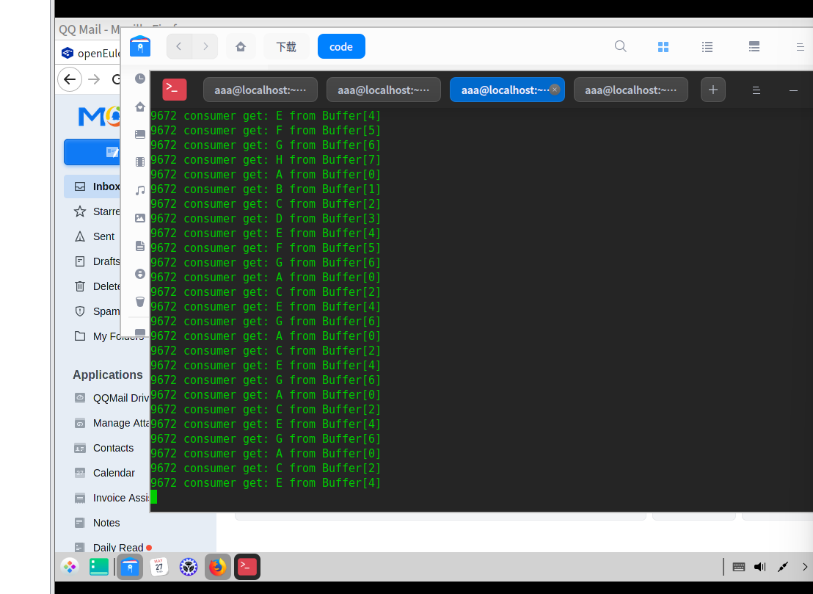

# oslab 04

软件2305 刘慈 20232241138

## 真实操作系统中提供的并发进程同步机制是怎样实现和解决同步问题的？

真实操作系统中提供的并发进程同步机制主要通过以下几种方式实现和解决同步问题：

### 1. **互斥锁（Mutex）**
互斥锁是一种并发编程中常用的同步机制，用于实现对共享资源的互斥访问，防止多个进程或线程同时访问和修改共享资源而引发的竞态条件问题。

- **实现原理**：
  - **获取锁（Lock）**：当一个进程或线程需要访问共享资源时，它会尝试获取互斥锁。如果锁已被其他进程或线程占用，则当前进程或线程将被阻塞，直到锁被释放。
  - **释放锁（Unlock）**：当一个进程或线程完成对共享资源的访问后，它会释放互斥锁，使其他进程或线程可以获取锁并访问资源。

- **应用场景**：
  - **生产者/消费者问题**：生产者和消费者对共享缓冲区的访问需要互斥锁来确保每次只有一个进程可以访问缓冲区。
  - **多线程环境**：在多线程环境中，互斥锁常用于保护共享变量或数据结构，防止多个线程同时修改导致数据不一致。

### 2. **信号量（Semaphore）**
信号量是一种并发编程中常用的同步机制，用于实现对共享资源的访问控制和同步操作。它可以用于解决多进程或多线程之间的同步和互斥问题。

- **实现原理**：
  - **P操作（Wait/Down）**：如果信号量的值大于0，将其减1，表示占用一个资源。如果信号量的值为0，则进程或线程会被阻塞等待，直到信号量的值大于0。
  - **V操作（Signal/Up）**：将信号量的值加1，表示释放一个资源，并唤醒一个或多个等待的进程或线程。

- **应用场景**：
  - **生产者/消费者问题**：通过创建两个信号量“empty”和“full”来分别表示缓冲区中可用的空槽位数量和已填充的数据数量，从而协调生产者和消费者之间的操作。
  - **多进程同步**：信号量可以用于同步多个进程的执行，例如，一个进程可以等待其他进程完成初始化工作后再开始执行。

### 3. **条件变量（Condition Variable）**
条件变量是一种高级同步机制，用于在多个进程或线程之间协调操作，通常与互斥锁一起使用。

- **实现原理**：
  - **等待（Wait）**：当一个进程或线程需要等待某个条件成立时，它会调用等待操作，释放互斥锁并进入等待状态。
  - **通知（Signal/Broadcast）**：当某个条件成立时，一个进程或线程会调用通知操作，唤醒一个或多个等待的进程或线程。

- **应用场景**：
  - **生产者/消费者问题**：生产者和消费者可以使用条件变量来协调操作，生产者在缓冲区满时等待，消费者在缓冲区空时等待。
  - **多线程同步**：条件变量常用于多线程环境中，协调线程的执行顺序，例如，一个线程等待另一个线程完成某个任务后再继续执行。

### 4. **读写锁（Reader-Writer Lock）**
读写锁是一种特殊的锁，允许多个读者同时访问共享资源，但写操作需要独占访问。

- **实现原理**：
  - **读锁（Read Lock）**：允许多个读者同时获取读锁，但写操作需要等待所有读者释放读锁。
  - **写锁（Write Lock）**：写操作需要独占访问，获取写锁后，其他读者和写者都不能访问资源。

- **应用场景**：
  - **多读者少写者场景**：在多读者少写者的场景中，读写锁可以提高系统的并发性能，允许多个读者同时访问共享资源，但写操作需要独占访问。

真实操作系统通过互斥锁、信号量、条件变量、读写锁、屏障和事件等多种同步机制，实现了并发进程的同步与互斥。这些机制通过不同的操作和机制，确保了多个进程或线程在访问共享资源时的正确性和一致性，避免了竞态条件和死锁问题，提高了系统的并发性能和可靠性。


### 生产者消费者问题

**关键信息：**

- **共享缓冲区**：生产者将数据放入缓冲区，消费者从缓冲区读取数据。
- **信号量**：
  - **empty**：表示缓冲区中可用的空槽位数量，初始化为缓冲区的大小。
  - **full**：表示缓冲区中已填充的数据数量，初始化为0。
- **生产者操作**：
  - 检查“empty”信号量的值，如果大于0，执行生产操作，将数据放入缓冲区。
  - 将“empty”信号量的值减1，表示占用一个空槽位。
  - 如果“full”信号量的值为0，执行V操作，增加“full”信号量的值，唤醒等待的消费者。
- **消费者操作**：
  - 检查“full”信号量的值，如果大于0，执行消费操作，从缓冲区读取数据。
  - 将“full”信号量的值减1，表示消费一个数据。
  - 如果“empty”信号量的值为0，执行V操作，增加“empty”信号量的值，唤醒等待的生产者。

在生产者消费者问题中，信号量用于同步生产者和消费者对共享缓冲区的访问。首先，创建一个共享缓冲区，生产者向其中放入数据，消费者从中读取数据。设置两个信号量：“empty”初始化为缓冲区大小，表示空槽位数量；“full”初始化为0，表示已填充数据数量。生产者在“empty”大于0时放入数据，随后减少“empty”并可能增加“full”唤醒消费者。消费者在“full”大于0时读取数据，随后减少“full”并可能增加“empty”唤醒生产者。

### 抽烟者问题代码分析

#### 共享资源和信号量

1. **共享内存**:
   - `buff_ptr`: 长度为8的字符数组，用于表示当前提供的材料组合
   - `pput_ptr`: 生产者指针，表示当前提供的材料组合类型
   - `cget_ptr`: 消费者指针，用于控制轮流消费

2. **信号量**:
   - `prod_sem`: 生产者信号量，初始值为8（缓冲区大小）
   - `cons_sem`: 消费者信号量，初始值为0
   - `pmtx_sem`: 生产者互斥信号量，初始值为1
   - `cmtx_sem`: 消费者互斥信号量，初始值为1

#### 生产者(供应者)逻辑

1. 生产者有三种状态，轮流提供不同的材料组合:
   - 'A': 烟草和纸
   - 'B': 烟草和胶水
   - 'C': 胶水和纸

2. 生产者通过`*pput_ptr`的值(0,1,2)来决定提供哪种组合

3. 每次生产后，生产者会休眠一段时间(rate=3秒)

#### 消费者(抽烟者)逻辑

1. 三个消费者分别对应:
   - 消费者0: 有胶水，需要烟草和纸('A')
   - 消费者1: 有纸，需要烟草和胶水('B')
   - 消费者2: 有烟草，需要胶水和纸('C')

2. 消费者检查`buff_ptr[0]`是否匹配自己的需求

3. 消费者通过`*cget_ptr`的值来轮流消费，确保公平性

#### 代码实现

consumer.c

```c
#include "ipc.h"
int main(int argc, char* argv[]) {
    int rate = 3;
    int consumerid = atoi(argv[1]);
    buff_h = 101;
    buff_number = 8;
    cget_h = 103;
    cget_number = 1;
    shm_flg = IPC_CREAT | 0644;
    buff_ptr = (char*)set_shm(buff_h, buff_number, shm_flg);
    cget_ptr = (int*)set_shm(cget_h, cget_number, shm_flg);
    prod_h = 201;
    pmtx_h = 202;
    cons_h = 301;
    cmtx_h = 302;
    sem_flg = IPC_CREAT | 0644;
    sem_val = buff_number;
    prod_sem = set_sem(prod_h, sem_val, sem_flg);
    sem_val = 0;
    cons_sem = set_sem(cons_h, sem_val, sem_flg);
    sem_val = 1;
    cmtx_sem = set_sem(cmtx_h, sem_val, sem_flg);
    if (consumerid == 0)
        *cget_ptr = 0;
    while (1) {
        if (buff_ptr[0] - 'A' == consumerid) {
            down(cons_sem);
            down(cmtx_sem);
            sleep(rate);
            if (buff_ptr[0] == 'A') {
                printf(
                    "%d The consumer has glue.\nThe consumer gets tobacco and "
                    "paper\n",
                    getpid());
            }
            if (buff_ptr[0] == 'B') {
                printf(
                    "%d The consumer has paper.\nThe consumer gets tobacco and "
                    "glue\n",
                    getpid());
            }
            if (buff_ptr[0] == 'C') {
                printf(
                    "%d The consumer has tobacco.\nThe consumer gets glue and "
                    "paper\n",
                    getpid());
            }
            *cget_ptr = (*cget_ptr + 1);
            if (*cget_ptr % 2 == 0)
                buff_ptr[0] = 'D';
            else
                buff_ptr[0] = 'E';
            up(cmtx_sem);
            up(prod_sem);
        }
    }
    return EXIT_SUCCESS;
}

```

ipc.c

```c

#include "ipc.h"

// 生产消费者共享缓冲区即其有关的变量
key_t buff_key;
int buff_num;
char* buff_ptr;

// 生产者放产品位置的共享指针
key_t pput_key;
int pput_num;
int* pput_ptr;

// 消费者取产品位置的共享指针
key_t cget_key;
int cget_num;
int* cget_ptr;
int buff_num;
int pput_num;
int buff_number;
int pput_number;
int cget_number;

key_t pput_h;
key_t prod_h;
key_t pmtx_h;
key_t cons_h;
key_t cmtx_h;

key_t buff_h;
key_t cget_h;

// 生产者有关的信号量
key_t prod_key;
key_t pmtx_key;
int prod_sem;
int pmtx_sem;

// 消费者有关的信号量
key_t cons_key;
key_t cmtx_key;
int cons_sem;
int cmtx_sem;
int sem_val;
int sem_flg;
int shm_flg;
int get_ipc_id(char* proc_file, key_t key) {
    FILE* pf;                        // 定义文件指针
    int i, j;                        // 定义整型变量i和j
    char line[BUFSZ], colum[BUFSZ];  // 定义字符数组line和colum
    if ((pf = fopen(proc_file, "r")) == NULL) {  // 如果文件指针为空，则出错
        perror("Proc file not open");            // 打印错误信息
        exit(EXIT_FAILURE);                      // 退出程序
    }
    fgets(line, BUFSZ, pf);          // 读取文件的第一行
    while (!feof(pf)) {              // 如果文件没有结束
        i = j = 0;                   // 初始化i和j
        fgets(line, BUFSZ, pf);      // 读取文件的一行
        while (line[i] == ' ')       // 如果这一行是空格
            i++;                     // 则跳过这一行
        while (line[i] != ' ')       // 如果这一行不是空格
            colum[j++] = line[i++];  // 则将这一行的内容赋值给colum
        colum[j] = '\0';  // 将colum字符数组的最后一个元素赋值为空字符
        if (atoi(colum) != key)      // 如果atoi(colum)的值不等于key
            continue;                // 则跳过这一行
        j = 0;                       // 初始化j
        while (line[i] == ' ')       // 如果这一行是空格
            i++;                     // 则跳过这一行
        while (line[i] != ' ')       // 如果这一行不是空格
            colum[j++] = line[i++];  // 则将这一行的内容赋值给colum
        colum[j] = '\0';  // 将colum字符数组的最后一个元素赋值为空字符
        i = atoi(colum);  // 将colum字符数组的值转换为整数
        fclose(pf);       // 关闭文件
        return i;         // 返回整数值
    }
    fclose(pf);  // 关闭文件
    return -1;   // 返回-1
}
int down(int sem_id) {
    // 声明一个struct sembuf类型的变量buf
    struct sembuf buf;
    // 将buf.sem_op设置为-1
    buf.sem_op = -1;
    // 将buf.sem_num设置为0
    buf.sem_num = 0;
    // 将buf.sem_flg设置为SEM_UNDO
    buf.sem_flg = SEM_UNDO;
    // 如果semop函数的返回值小于0，则输出错误信息，并退出程序
    if ((semop(sem_id, &buf, 1)) < 0) {
        perror("down error ");
        exit(EXIT_FAILURE);
    }
    // 返回成功
    return EXIT_SUCCESS;
}

int up(int sem_id) {
    struct sembuf buf;
    buf.sem_op = 1;
    buf.sem_num = 0;
    buf.sem_flg = SEM_UNDO;
    if ((semop(sem_id, &buf, 1)) < 0) {
        perror("up error ");
        exit(EXIT_FAILURE);
    }
    return EXIT_SUCCESS;
}

int set_sem(key_t sem_key, int sem_val, int sem_flg) {
    int sem_id;
    Sem_uns sem_arg;

    // 测试由 sem_key 标识的信号灯数组是否已经建立
    if ((sem_id = get_ipc_id("/proc/sysvipc/sem", sem_key)) < 0) {
        // semget 新建一个信号灯,其标号返回到 sem_id
        if ((sem_id = semget(sem_key, 1, sem_flg)) < 0) {
            perror("semaphore create error");
            exit(EXIT_FAILURE);
        }
        // 设置信号灯的初值
        sem_arg.val = sem_val;
        if (semctl(sem_id, 0, SETVAL, sem_arg) < 0) {
            perror("semaphore set error");
            exit(EXIT_FAILURE);
        }
    }
    return sem_id;
}

char* set_shm(key_t shm_key, int shm_num, int shm_flg) {
    int i, shm_id;
    char* shm_buf;

    // 测试由 shm_key 标识的共享内存区是否已经建立
    if ((shm_id = get_ipc_id("/proc/sysvipc/shm", shm_key)) < 0) {
        // shmget 新建 一个长度为 shm_num 字节的共享内存,其标号返回到 shm_id
        if ((shm_id = shmget(shm_key, shm_num, shm_flg)) < 0) {
            perror("shareMemory set error");
            exit(EXIT_FAILURE);
        }
        // shmat 将由 shm_id 标识的共享内存附加给指针 shm_buf
        if ((shm_buf = (char*)shmat(shm_id, 0, 0)) < (char*)0) {
            perror("get shareMemory error");
            exit(EXIT_FAILURE);
        }
        for (i = 0; i < shm_num; i++)
            shm_buf[i] = 0;
        // 初始为 0
    }
    // shm_key 标识的共享内存区已经建立,将由 shm_id 标识的共享内存附加给指 针
    // shm_buf
    if ((shm_buf = (char*)shmat(shm_id, 0, 0)) < (char*)0) {
        perror("get shareMemory error");
        exit(EXIT_FAILURE);
    }
    return shm_buf;
}

int set_msq(key_t msq_key, int msq_flg) {
    int msq_id;
    // 测试由 msq_key 标识的消息队列是否已经建立
    if ((msq_id = get_ipc_id("/proc/sysvipc/msg", msq_key)) < 0) {
        // msgget 新建一个消息队列,其标号返回到 msq_id
        if ((msq_id = msgget(msq_key, msq_flg)) < 0) {
            perror("messageQueue set error");
            exit(EXIT_FAILURE);
        }
    }
    return msq_id;
}
```

ipc.h

```h
#include <stdio.h>
#include <stdlib.h>
#include <sys/ipc.h>
#include <sys/msg.h>
#include <sys/sem.h>
#include <sys/shm.h>
#include <sys/types.h>
#include <unistd.h>

#define BUFSZ 256  // 建立或获取 ipc 的一组函数的原型说明

int get_ipc_id(char* proc_file, key_t key);
char* set_shm(key_t shm_key, int shm_num, int shm_flag);
int set_msq(key_t msq_key, int msq_flag);
int set_sem(key_t sem_key, int sem_val, int sem_flag);
int down(int sem_id);
int up(int sem_id);

/*信号灯控制用的共同体*/
typedef union semuns {
    int val;
} Sem_uns;

/* 消息结构体*/
typedef struct msgbuf {
    long mtype;
    char mtext[1];
} Msg_buf;

// 生产消费者共享缓冲区即其有关的变量
extern key_t buff_key;
extern int buff_num;
extern char* buff_ptr;

// 生产者放产品位置的共享指针
extern key_t pput_key;
extern int pput_num;
extern int* pput_ptr;

// 消费者取产品位置的共享指针
extern key_t cget_key;
extern int cget_num;
extern int* cget_ptr;
extern int buff_num;
extern int pput_num;
extern int buff_number;
extern int pput_number;
extern int cget_number;

extern key_t pput_h;
extern key_t prod_h;
extern key_t pmtx_h;
extern key_t cons_h;
extern key_t cmtx_h;

extern key_t buff_h;
extern key_t cget_h;

// 生产者有关的信号量
extern key_t prod_key;
extern key_t pmtx_key;
extern int prod_sem;
extern int pmtx_sem;

// 消费者有关的信号量
extern key_t cons_key;
extern key_t cmtx_key;
extern int cons_sem;
extern int cmtx_sem;
extern int sem_val;
extern int sem_flg;
extern int shm_flg;
```

producer.h

```c
#include "ipc.h"
int main(int argc, char* argv[]) {
    int rate = 3;
    int producerid = atoi(argv[1]);
    buff_h = 101;
    buff_number = 8;
    pput_h = 102;
    pput_number = 1;
    shm_flg = IPC_CREAT | 0644;
    buff_ptr = (char*)set_shm(buff_h, buff_number, shm_flg);
    pput_ptr = (int*)set_shm(pput_h, pput_number, shm_flg);
    prod_h = 201;
    pmtx_h = 202;
    cons_h = 301;
    cmtx_h = 302;
    sem_flg = IPC_CREAT | 0644;
    sem_val = buff_number;
    prod_sem = set_sem(prod_h, sem_val, sem_flg);
    sem_val = 0;
    cons_sem = set_sem(cons_h, sem_val, sem_flg);
    sem_val = 1;
    pmtx_sem = set_sem(pmtx_h, sem_val, sem_flg);
    if (producerid == 0) {
        buff_ptr[0] = 'D';
        *pput_ptr = 0;
    }
    while (1) {
        if (buff_ptr[0] - 'D' == producerid) {
            down(prod_sem);
            down(pmtx_sem);
            *pput_ptr = (*pput_ptr + 1) % 3;
            if (*pput_ptr == 0) {
                buff_ptr[0] = 'A';
                printf("%d The producer gives tobacco and paper\n", getpid());
            }
            if (*pput_ptr == 1) {
                buff_ptr[0] = 'B';
                printf("%d The producer gives tobacco and glue\n", getpid());
            }
            if (*pput_ptr == 2) {
                buff_ptr[0] = 'C';
                printf("%d The producer gives glue and paper\n", getpid());
            }
            sleep(rate);
            up(pmtx_sem);
            up(cons_sem);
        }
    }
    return EXIT_SUCCESS;
}

```

#### 结果

程序运行后，你会看到类似以下的输出交替出现:

1. 生产者提供材料组合:
  
  ```
   [pid] The producer gives tobacco and paper
   [pid] The producer gives tobacco and glue 
   [pid] The producer gives glue and paper
   ```

2. 消费者获取材料并抽烟:

   ```
   [pid] The consumer has glue. The consumer gets tobacco and paper
   [pid] The consumer has paper. The consumer gets tobacco and glue
   [pid] The consumer has tobacco. The consumer gets glue and paper
   ```

3. 这个过程会无限循环下去，每次都是:
   - 生产者提供两种材料
   - 对应的抽烟者(缺少第三种材料的)获取材料并抽烟
   - 通知生产者可以继续提供新材料
  
  


#### 同步机制说明

1. 生产者使用`prod_sem`和`pmtx_sem`来保证互斥和同步
2. 消费者使用`cons_sem`和`cmtx_sem`来保证互斥和同步
3. 通过共享内存`buff_ptr`和`cget_ptr`来传递状态信息
4. 使用`*cget_ptr % 2`来决定是否切换材料组合('D'或'E')

这个实现确保了:

- 任何时候只有一个生产者或消费者在操作共享资源
- 材料提供和消费是交替进行的
- 三个抽烟者有机会公平地获取材料

## 信号灯机制是怎样完成进程的互斥和同步的？

信号灯机制（Semaphore Mechanism）通过信号量（Semaphore）的P操作（Wait/Down）和V操作（Signal/Up）来完成进程的互斥和同步。信号量是一个整数值，用于控制多个进程对共享资源的访问。以下是信号灯机制完成互斥和同步的具体过程：

### 一、互斥（Mutex）

互斥是指在任何时刻，只有一个进程可以访问共享资源。信号灯机制通过互斥信号量（通常初始值为1）来实现互斥。

- **P操作（Wait/Down）**：
  - 当进程需要访问共享资源时，它会执行P操作。
  - 如果信号量的值大于0，表示资源可用，信号量的值减1，进程继续执行。
  - 如果信号量的值为0，表示资源已被占用，进程将被阻塞，直到信号量的值大于0。

- **V操作（Signal/Up）**：
  - 当进程完成对共享资源的访问后，它会执行V操作。
  - 信号量的值加1，表示资源被释放。
  - 如果有其他进程在等待该资源，操作系统会选择一个进程唤醒它。

### 二、同步（Synchronization）

同步是指多个进程在访问共享资源时，必须按照一定的顺序进行操作，以避免数据不一致。信号灯机制通过计数信号量（初始值可以是任意正整数）来实现同步。

- **P操作（Wait/Down）**：
  - 当进程需要访问共享资源时，它会执行P操作。
  - 如果信号量的值大于0，表示资源可用，信号量的值减1，进程继续执行。
  - 如果信号量的值为0，表示资源不可用，进程将被阻塞，直到信号量的值大于0。

- **V操作（Signal/Up）**：
  - 当进程完成对共享资源的访问后，它会执行V操作。
  - 信号量的值加1，表示资源被释放。
  - 如果有其他进程在等待该资源，操作系统会选择一个进程唤醒它。

### 四、应用场景

#### 1. **生产者/消费者问题**

在生产者/消费者问题中，使用两个信号量来实现同步和互斥：

- **empty**：表示缓冲区中可用的空槽位数量，初始值为缓冲区的大小。
- **full**：表示缓冲区中已填充的数据数量，初始值为0。

- **生产者操作**：
  
  ```c
  P(empty); // 等待空槽位
  // 生产操作，将数据放入缓冲区
  V(full); // 增加已填充的数据数量
  ```

- **消费者操作**：
  
  ```c
  P(full); // 等待已填充的数据
  // 消费操作，从缓冲区读取数据
  V(empty); // 增加空槽位数量
  ```

#### 2. **抽烟者问题**

在抽烟者问题中，使用三个信号量来表示三种资源（烟草、纸、胶水），初始值为0。

- **供应者操作**：
  
  ```c
  // 提供资源
  V(key_tobacco); // 增加烟草的可用性
  V(key_paper); // 增加纸的可用性
  V(key_glue); // 增加胶水的可用性
  ```

- **抽烟者操作**：
  
  ```c
  P(key_tobacco); // 等待烟草可用
  P(key_paper); // 等待纸可用
  // 抽烟操作
  ```

#### 总结


信号灯机制通过P操作和V操作实现进程的互斥和同步。互斥信号量确保在任何时刻只有一个进程可以访问共享资源，而计数信号量则用于控制多个进程对资源的访问，确保资源的正确使用。通过这种方式，信号灯机制能够有效地解决并发进程中的同步问题，避免竞态条件和死锁问题，提高系统的并发性能和可靠性。

## 信号量的初值和其值的变化的物理意义是什么?

信号量的初值和其值的变化具有重要的物理意义，它们反映了系统中资源的可用性和进程的执行状态。以下是信号量的初值和值变化的详细解释：

### 一、信号量的初值

信号量的初值表示系统开始时可用资源的数量或者特定条件的满足程度。具体来说：

- **互斥信号量**：初值通常为1，表示资源初始时是可用的。如果初值为0，表示资源初始时不可用。
- **计数信号量**：初值可以是任意正整数，表示资源的初始可用数量。例如，在生产者/消费者问题中，“empty”信号量的初值表示缓冲区初始时的空槽位数量，“full”信号量的初值表示缓冲区初始时的已填充数据数量。

### 二、信号量值的变化

信号量值的变化表示资源的使用情况和条件的变化。具体来说：

- **P操作（Wait/Down）**：如果信号量的值大于0，将其减1，表示占用一个资源。如果信号量的值为0，进程将被阻塞，直到信号量的值大于0。
- **V操作（Signal/Up）**：将信号量的值加1，表示释放一个资源，并唤醒一个或多个等待的进程。

### 三、物理意义

- **信号量值的减少**：表示资源被占用，或者某个条件不再满足。例如，当生产者将数据放入缓冲区时，“empty”信号量的值减少，表示一个空槽位被占用。
- **信号量值的增加**：表示资源被释放，或者某个条件再次满足。例如，当消费者从缓冲区读取数据时，“full”信号量的值增加，表示一个数据被消费，缓冲区中又有了一个空槽位。

###  四、应用场景

- **生产者/消费者问题**：通过“empty”和“full”信号量的值变化，生产者和消费者可以协调对缓冲区的访问，确保缓冲区的正确使用。
- **抽烟者问题**：通过三个信号量（烟草、纸、胶水）的值变化，供应者和抽烟者可以协调对资源的访问，确保资源的正确使用。

#### 总结

信号量的初值和值变化是信号灯机制中非常重要的概念，它们反映了系统中资源的可用性和进程的执行状态。通过合理设置信号量的初值和正确执行P操作和V操作，可以有效地实现进程的互斥和同步，解决并发进程中的同步问题，提高系统的并发性能和可靠性。

## 使用多于 4 个的生产者和消费者

先运行2个生产者：


可以看到 1719 号进程向共享内存写入了8个字符后因缓冲区满而阻塞

再启动一个速率为 3 的消费者进程



再启动一个速率为 4 的消费者进程


经观察能够满足同步的需求

github仓库地址：https://github.com/lc-369/oslab.git
